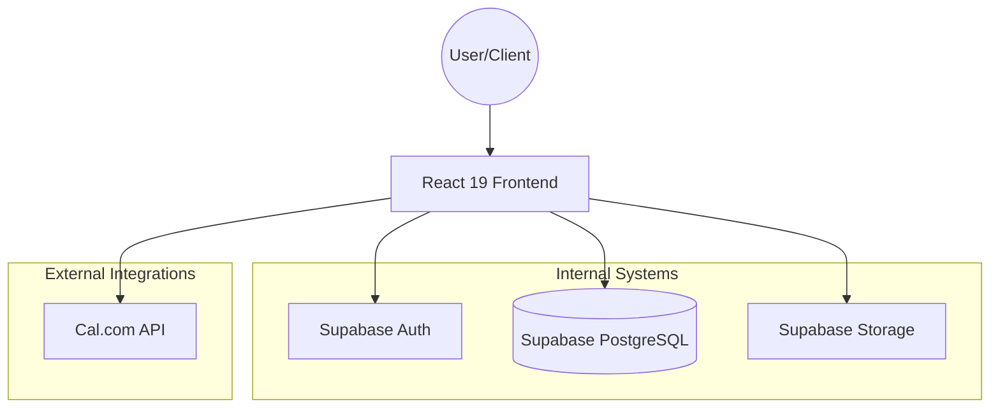

# System Architecture

This document describes the high-level architecture of the C4 Marketing application.

## Overview

The application is a Project and Proposal Management system built for C4 Marketing. It uses a modern Serverless architecture with a React frontend and Supabase as the Backend-as-a-Service (BaaS).

## Technology Stack

- **Frontend**: [React 19](https://react.dev/), [TypeScript](https://www.typescriptlang.org/), [Vite](https://vitejs.dev/)
- **Styling**: Vanilla CSS (Premium Custom Design)
- **Backend**: [Supabase](https://supabase.com/) (PostgreSQL + Auth + Storage)
- **Deployment**: [Vercel](https://vercel.com/)
- **Integrations**:
  - **Cal.com**: For meeting scheduling.
  - **Lucide React**: For icons.

## High-Level Flow

## Core Modules

### 1. Proposal Management

Handles the creation, viewing, and acceptance of service proposals. It generates dynamic URLs for clients to review and sign contracts.

### 2. Project Management

Once a proposal is accepted, it becomes a project. The system manages different types of projects:

- **Traffic Management**: Strategy, campaigns, and timeline management.
- **Landing Pages & Websites**: Creative briefs, development stages, and hosting.
- **Consulting**: Strategic advisory and meetings.

### 3. Survey System

External forms used to collect information from clients (Traffic Surveys, Briefings, Access Guides). The data is stored in Supabase and used to populate project dashboards.

### 4. User & Role Management

Role-based access control (RBAC) implemented via `UserRoleContext`. Roles include:

- `admin`: Full system access.
- `gestor`: Management access.
- `comercial`: Sales focused.
- `operacional`: Project execution focused.
- `leitor`: Read-only access.

## Data Flow: Proposal to Project

1. **Commercial** creates a Proposal.
2. **Client** receives a link, reviews, and clicks "Aceitar".
3. **System** transforms the Proposal into an active **Project**.
4. **Operational** team manages the Project stages (Planning, Development, Launch).
