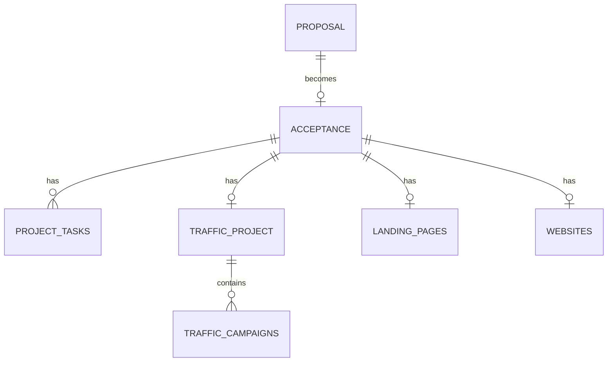

# Database Schema

This document outlines the Supabase (PostgreSQL) database schema for the C4 Marketing system.

## Core Tables

### `proposals`

Stores the sales proposals sent to clients.

- `id`: Primary key.
- `client_name`: Name of the potential client.
- `slug`: Unique identifier used for the public URL.
- `status`: draft, sent, accepted, rejected.
- `content`: JSON or text containing the proposal services and values.

### `acceptances`

Stores the details of an accepted proposal, effectively starting a project.

- `id`: Primary key.
- `proposal_id`: Link to the proposal.
- `client_email`: Email of the person who accepted.
- `signed_at`: Timestamp of acceptance.

### `project_tasks`

General purpose tasks related to any project (Kanban style).

- `id`: UUID.
- `project_id`: Link to `acceptances(id)`.
- `title`: Task title.
- `status`: backlog, in_progress, approval, done, paused.
- `priority`: low, medium, high.

## Service-Specific Tables

### Traffic Management (`traffic_*`)

#### `traffic_projects`

Stores the configuration for a Traffic Management project.

- `acceptance_id`: Link to `acceptances(id)`.
- `survey_status`: pending, completed.
- `strategy_meeting_notes`: Text notes from the strategy call.

#### `traffic_campaigns`

Stores the ad campaigns for a project.

- `platform`: google_ads, meta_ads, linkedin_ads, tiktok_ads.
- `status`: active, paused, ended.

### Landing Pages (`landing_pages`)

- `acceptance_id`: Link to `acceptances(id)`.
- `briefing_status`: pending, completed.
- `url`: The final URL of the landing page.

### Website & E-commerce (`websites`, `ecommerce`)

Similar structure to Landing Pages, storing brief status and configuration details.

## Utilities

### `notices`

Stores system notifications and popups shown to users.

### `app_users_profile`

Extended profile information for authenticated users, including their assigned roles.

## Relationship Diagram

## RLS (Row Level Security)

Most tables have RLS enabled with a general policy allowing access to `authenticated` users. Some tables used for external surveys (like `traffic_projects` updates via external link) have special policies to allow anonymous updates based on ID validation.
