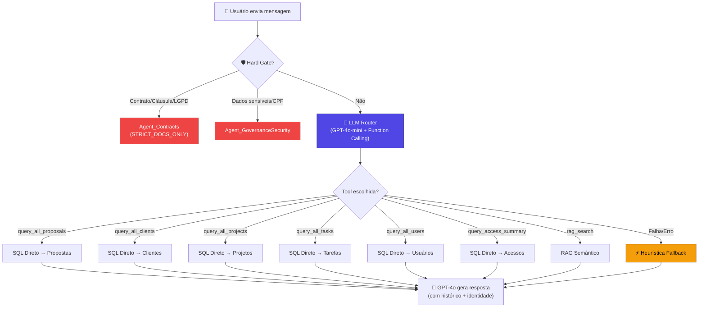
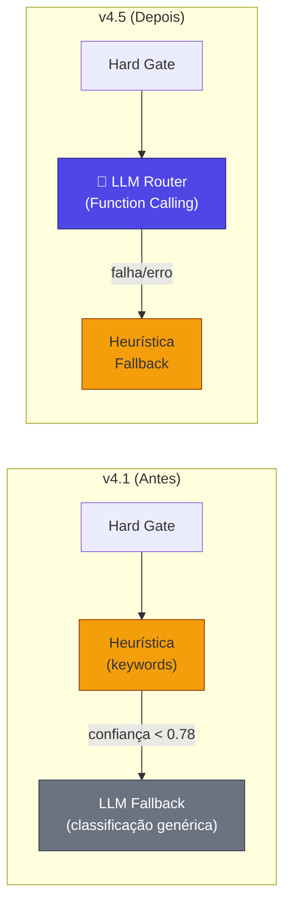
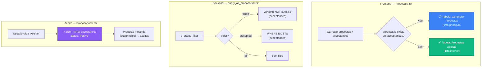
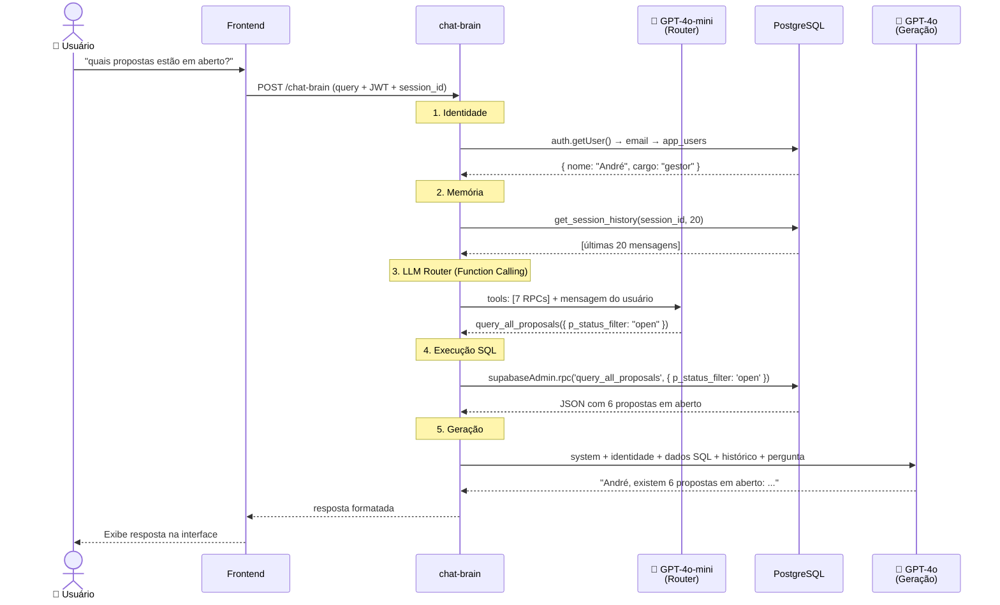
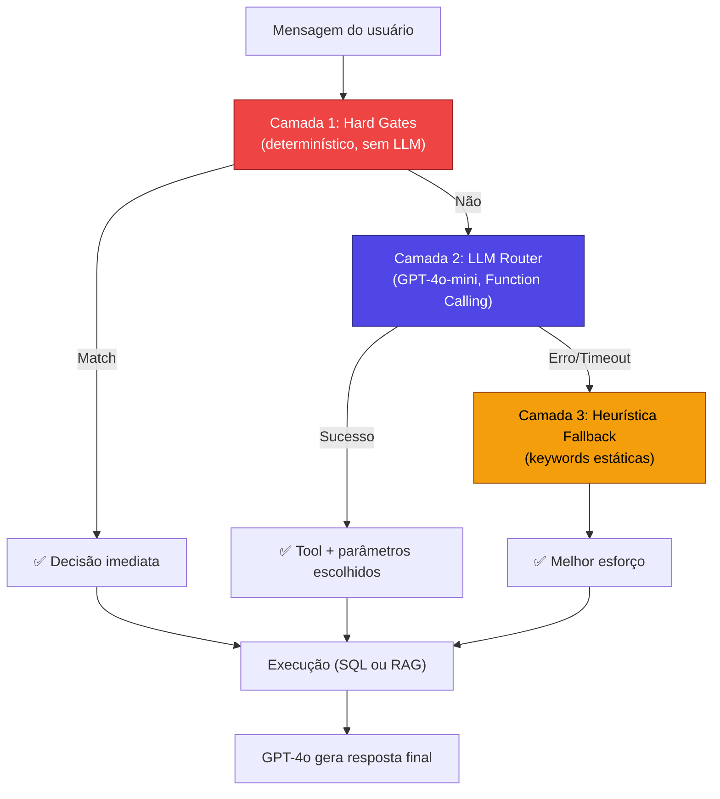

# Relatório Técnico v4.5: LLM Router Inteligente e Gestão de Propostas

**Sistema "Segundo Cérebro" da C4 Marketing — 17 de Fevereiro de 2026**

A versão 4.5 resolve a fragilidade fundamental do sistema de roteamento: **o agente dependia de listas de palavras-chave hardcoded** para decidir qual consulta executar. Agora ele usa **GPT-4o-mini com Function Calling** para entender o contexto semântico de qualquer pergunta em linguagem natural. Além disso, propostas aceitas são separadas das abertas em toda a stack.

---

## Linha do Tempo da Evolução

| Versão | Nome | Capacidade Principal |
|--------|------|---------------------|
| v1 | Chat RAG | Busca vetorial + filtro anti-eco |
| v2 | Agentic RAG | Router heurístico, 6 Agentes, ETL automático |
| v3 | Hybrid Intelligence | Tool Use (RAG + SQL direto) |
| v4.1 | Cognitive Agent | Identidade + Memória de Sessão + Cobertura Total |
| **v4.5** | **Semantic Router** | **LLM Router (Function Calling) + Gestão de Propostas** |

---

## Mudança Arquitetural Principal: De Keywords para Semântica

### O Problema (v2–v4.1)

O roteamento do sistema dependia de **listas de palavras-chave fixas** para decidir qual ferramenta usar:

```typescript
// ❌ Abordagem antiga (heurística)
if (hasAny(msg, ["aberta", "pendente", "aguardando"])) {
    statusFilter = 'open'  // ← e se o usuário disser "em aberto"?
}
```

Isso gerava falhas reais:

- **"quais propostas estão em aberto?"** → Palavra "aberto" não matchava com "aberta" → resposta errada
- **"quais propostas..."** → "quais" sozinho não era keyword de listagem → caía no RAG genérico
- **"tem tarefa pendente?"** → Sem "liste" ou "todos", não era detectado como listagem

Cada erro exigia adição manual de mais keywords, criando uma lista infinita e frágil.

### A Solução (v4.5): LLM Router com Function Calling

Em vez de keywords, o sistema agora usa **GPT-4o-mini como classificador inteligente**. O LLM recebe as ferramentas disponíveis (RPCs) como funções tipadas e **escolhe qual usar** com base na compreensão semântica da pergunta:

```typescript
// ✅ Abordagem nova (LLM Function Calling)
const completion = await openai.chat.completions.create({
    model: 'gpt-4o-mini',       // Rápido (~500ms) e barato (~$0.001/chamada)
    temperature: 0,              // Determinístico
    tools: availableTools,       // 7 ferramentas tipadas
    tool_choice: "required",     // Sempre escolhe uma
    messages: [
        { role: 'system', content: routerPrompt },
        { role: 'user', content: perguntaDoUsuario }
    ]
})
```

O LLM entende naturalmente que todas estas frases significam a mesma coisa:

- "quais propostas estão em aberto?"
- "me mostra as propostas que ainda não foram aceitas"
- "tem algum orçamento pendente?"
- "quantos negócios não fechamos ainda?"

→ Todas mapeiam para: `query_all_proposals({ p_status_filter: "open" })`

---

## 1. Arquitetura do LLM Router

### Diagrama de Fluxo: Roteamento v4.5



### Hierarquia de Decisão (v4.1 → v4.5)



**Inversão crítica**: Na v4.1, a heurística (keywords) era executada PRIMEIRO e o LLM era fallback. Na v4.5, o **LLM é executado PRIMEIRO** e a heurística é o fallback para resiliência.

---

## 2. Ferramentas Tipadas (Function Definitions)

O LLM Router recebe 7 ferramentas com **schemas JSON tipados**:

```
┌─────────────────────────┬────────────────────────────────────────────────────┐
│ Ferramenta              │ Parâmetros                                         │
├─────────────────────────┼────────────────────────────────────────────────────┤
│ query_all_proposals     │ p_status_filter: "all" | "open" | "accepted"      │
├─────────────────────────┼────────────────────────────────────────────────────┤
│ query_all_clients       │ p_status: "Ativo" | "Inativo" | "Suspenso" | ... │
├─────────────────────────┼────────────────────────────────────────────────────┤
│ query_all_projects      │ p_service_type: "traffic" | "website" | "lp"     │
│                         │ p_status_filter: "Ativo" | "Inativo"             │
├─────────────────────────┼────────────────────────────────────────────────────┤
│ query_all_tasks         │ p_project_id: number (opcional)                   │
│                         │ p_status: "todo" | "in_progress" | "done" | ...  │
├─────────────────────────┼────────────────────────────────────────────────────┤
│ query_all_users         │ (sem parâmetros)                                  │
├─────────────────────────┼────────────────────────────────────────────────────┤
│ query_access_summary    │ (sem parâmetros)                                  │
├─────────────────────────┼────────────────────────────────────────────────────┤
│ rag_search              │ (busca semântica — documentos e contratos)        │
└─────────────────────────┴────────────────────────────────────────────────────┘
```

### Prompt do Router

O system prompt do LLM Router inclui **exemplos de mapeamento** para guiar a classificação:

```
"quais propostas estão em aberto?" → query_all_proposals(p_status_filter: "open")
"quem são nossos clientes ativos?" → query_all_clients(p_status: "Ativo")
"liste todos os projetos de tráfego" → query_all_projects(p_service_type: "traffic")
"quem acessou o sistema hoje?" → query_access_summary()
"o que diz o contrato com a empresa X?" → rag_search()
"tem alguma tarefa pendente?" → query_all_tasks(p_status: "todo")
```

---

## 3. Gestão de Propostas: Open vs Accepted

### Problema Anterior

Todas as propostas apareciam em uma única lista. Não havia distinção visual entre propostas pendentes e aceitas, nem no frontend nem nas consultas do agente.

### Solução v4.5



### Mudanças por Arquivo

| Arquivo | Mudança |
|---------|---------|
| `ProposalView.tsx` | Aceite grava `status: 'Inativo'` na tabela `acceptances` |
| `Proposals.tsx` | Lista principal filtra `proposals.filter(p => !acceptances.some(...))` |
| `query_all_proposals` RPC | Novo parâmetro `p_status_filter` ('all', 'open', 'accepted') |
| `router.ts` | LLM Router seleciona filtro correto via function calling |

### SQL: RPC query_all_proposals (v4.5)

```sql
CREATE OR REPLACE FUNCTION public.query_all_proposals(
  p_status_filter text DEFAULT 'all'
)
RETURNS json
LANGUAGE plpgsql
SECURITY DEFINER
AS $$
BEGIN
  SELECT json_agg(p ORDER BY p.created_at DESC) INTO result
  FROM (
    SELECT p.*, 
      (SELECT count(*) FROM acceptances a WHERE a.proposal_id = p.id) > 0 AS was_accepted,
      (SELECT a.status FROM acceptances a WHERE a.proposal_id = p.id LIMIT 1) AS acceptance_status
    FROM proposals p
    WHERE
      (p_status_filter = 'all') OR
      (p_status_filter = 'open' AND NOT EXISTS (SELECT 1 FROM acceptances a WHERE a.proposal_id = p.id)) OR
      (p_status_filter = 'accepted' AND EXISTS (SELECT 1 FROM acceptances a WHERE a.proposal_id = p.id))
  ) p;
  RETURN COALESCE(result, '[]'::json);
END;
$$;
```

---

## 4. Limpeza de Parâmetros RPC

### Problema Detectado

Quando o LLM omitia um parâmetro opcional, o Function Calling às vezes enviava `null` ou `"null"` (string), causando erros silenciosos nas RPCs PostgreSQL.

### Solução: cleanParams

```typescript
const { rpc_name, ...rpcParams } = decision.db_query_params
// Limpar valores null/undefined/"null" antes de enviar ao PostgreSQL
const cleanParams: Record<string, any> = {}
for (const [k, v] of Object.entries(rpcParams)) {
    if (v !== null && v !== undefined && v !== 'null') cleanParams[k] = v
}
const { data, error } = await supabaseAdmin.rpc(rpc_name, cleanParams)
```

Isso garante que parâmetros com `DEFAULT NULL` nas RPCs sejam tratados como NULL real no PostgreSQL.

### Mensagem de Resultado Vazio Melhorada

```typescript
// ❌ Antes (v4.1) — GPT interpretava como "sem acesso"
contextText = 'Nenhum registro encontrado no banco de dados.'

// ✅ Agora (v4.5) — GPT entende que consultou mas não achou
contextText = `CONSULTA REALIZADA COM SUCESSO via ${rpc_name}, 
mas NENHUM registro foi encontrado. Informe ao usuário que a consulta 
foi feita no banco de dados e não há registros correspondentes no momento.`
```

---

## 5. Fluxo Completo (v4.5)



---

## 6. Comparativo Completo v1 → v4.5

| Dimensão | v1 | v2 | v3 | v4.1 | **v4.5** |
|----------|----|----|----|----- |----------|
| **Roteamento** | Nenhum | Keywords | Keywords + filtros | Keywords + LLM fallback | **🧠 LLM-first (Function Calling)** |
| **Identidade** | ❌ | ❌ | ❌ | ✅ Nome + Cargo | ✅ Nome + Cargo |
| **Memória** | ❌ | ❌ | ❌ | ✅ 20 msgs/sessão | ✅ 20 msgs/sessão |
| **Recuperação** | RAG puro | RAG + filtros | RAG + SQL | RAG + SQL + 6 RPCs | RAG + SQL + **7 RPCs tipadas** |
| **Propostas** | — | — | Lista única | Lista única | **Open vs Accepted** |
| **Robustez NLP** | — | Frágil | Frágil | Frágil (keywords) | **✅ Semântico (LLM)** |
| **Custo Router** | $0 | $0 | $0 | ~$0.03/chamada (GPT-4o) | **~$0.001/chamada (4o-mini)** |
| **Latência Router** | 0ms | 0ms | 0ms | ~2s (GPT-4o) | **~500ms (4o-mini)** |
| **Anti-alucinação** | Filtro tipo | Políticas | + SQL factual | + contexto real | + **resultado vazio explícito** |

---

## 7. Especificações Técnicas

- **Modelo de Geração**: GPT-4o (OpenAI)
- **Modelo de Roteamento**: GPT-4o-mini (Function Calling, temperature: 0)
- **Modelo de Embedding**: `text-embedding-3-small` (1536 dimensões)
- **Banco de Dados**: PostgreSQL 15 com `pgvector` + `pg_cron`
- **Infraestrutura**: Supabase Edge Functions (Deno)
- **RPCs**: 7 funções SQL (`query_all_projects`, `query_all_clients`, `query_all_proposals`, `query_all_users`, `query_all_tasks`, `query_access_summary`, `get_session_history`)
- **Contexto Multi-Turn**: Últimas 20 mensagens por sessão (~8.000 tokens)
- **Tabelas Cobertas**: 16 tabelas do schema `public` + 2 do schema `brain`
- **Custo estimado por consulta**: ~$0.004 (Router: $0.001 + Geração: $0.003)

---

## 8. Custo e Performance

### Comparativo de Custo do Router

| Versão | Modelo Router | Custo/chamada | Latência | Robustez |
|--------|--------------|---------------|----------|----------|
| v2–v4.1 | Heurística (keywords) | $0 | ~0ms | ❌ Frágil |
| v4.1 (fallback) | GPT-4o (JSON) | ~$0.03 | ~2.000ms | ⚠️ Médio |
| **v4.5** | **GPT-4o-mini (FC)** | **~$0.001** | **~500ms** | **✅ Robusto** |

### Estimativa de Custo Mensal

Considerando ~500 consultas/mês ao agente:

- **Router (GPT-4o-mini)**: 500 × $0.001 = **$0.50/mês**
- **Geração (GPT-4o)**: 500 × $0.003 = **$1.50/mês**
- **Total estimado**: **~$2.00/mês**

---

## 9. Resiliência: Três Camadas de Proteção



| Camada | Quando ativa | Latência | Exemplo |
|--------|-------------|----------|---------|
| **Hard Gate** | Contratos, dados sensíveis | 0ms | "qual a cláusula de rescisão?" |
| **LLM Router** | 95% das perguntas | ~500ms | "tem proposta pendente?" |
| **Heurística** | LLM falha ou timeout | 0ms | Fallback de segurança |

---

## 10. Impacto Prático

### Antes (v4.1) — Falha por keyword faltando

```
Usuário: "quais propostas estão em aberto?"
Router:  ❌ "quais" não era keyword → caiu no RAG genérico
Agente:  Retornou 3 propostas erradas (incluindo aceitas)

Usuário: "tem alguma tarefa pendente?"
Router:  ❌ "pendente" não era keyword de listagem
Agente:  "Não tenho acesso ao sistema de tarefas" (alucinação)
```

### Depois (v4.5) — Compreensão semântica

```
Usuário: "quais propostas estão em aberto?"
LLM:     ✅ query_all_proposals(p_status_filter: "open")
Agente:  Retornou as 6 propostas corretas em aberto

Usuário: "tem alguma tarefa pendente?"
LLM:     ✅ query_all_tasks(p_status: "todo")
Agente:  "André, não há tarefas pendentes no momento." (resultado real)

Usuário: "me mostra os clientes que estão inativos"
LLM:     ✅ query_all_clients(p_status: "Inativo")
Agente:  Retornou lista precisa de clientes inativos
```

---

## 11. Arquivos Modificados

| Arquivo | Tipo | Mudança |
|---------|------|---------|
| `supabase/functions/chat-brain/index.ts` | Backend | LLM Router com Function Calling (GPT-4o-mini), cleanup de params, mensagem de vazio melhorada |
| `supabase/functions/_shared/agents/router.ts` | Backend | Prioridade invertida (LLM-first, heurística-fallback), keywords expandidas como backup |
| `pages/Proposals.tsx` | Frontend | Filtro visual: propostas aceitas separadas da lista principal |
| `pages/ProposalView.tsx` | Frontend | Status inicial de aceite definido como 'Inativo' |
| `supabase/migrations/20260217204000_update_proposals_rpc.sql` | Migração | RPC `query_all_proposals` com parâmetro `p_status_filter` |

---

## Conclusão

A v4.5 marca a transição do Segundo Cérebro de **sistema baseado em regras** para **sistema baseado em compreensão**. O roteamento por keywords era um ponto de falha silencioso — o sistema parecia funcionar até encontrar uma variação linguística não prevista. Com o LLM Router:

1. **Qualquer forma de perguntar** é compreendida — sinônimos, variações, contexto implícito
2. **Novos filtros** não exigem código — basta adicionar parâmetros na definição da tool
3. **Custo insignificante** — ~$0.001 por classificação com GPT-4o-mini
4. **Zero manutenção de keywords** — o LLM aprende novas formas naturalmente

O próximo passo natural é expandir o catálogo de tools disponíveis (ex: `query_financial_summary`, `create_task`, `update_project_status`), transformando o agente de **consultor passivo** em **executor de ações** no sistema.
