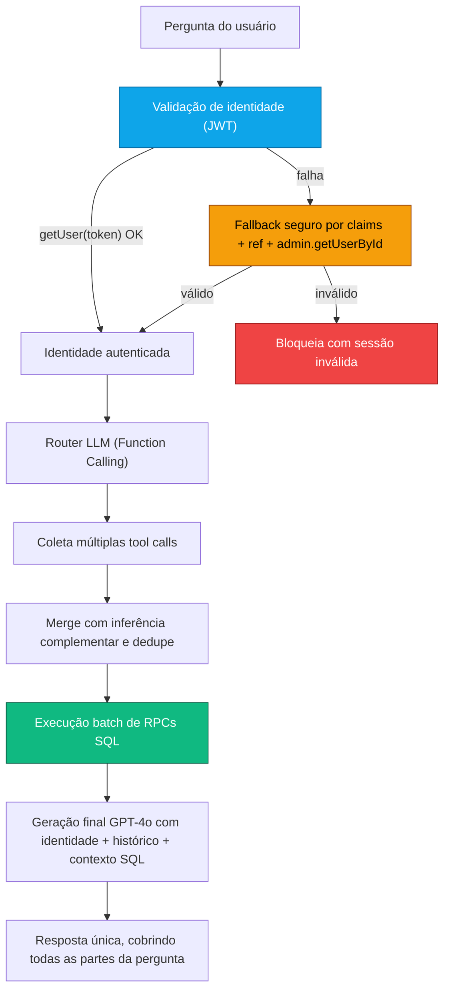

# Relatório Técnico v5.0: Resiliência de Autenticação e Multi-Consulta SQL

**Sistema "Segundo Cérebro" da C4 Marketing — 19 de Fevereiro de 2026**

A versão 5.0 foi focada em sanear um incidente crítico de produção: o agente apresentava `Sessão inválida (JWT)` em cenários reais e, quando respondia, tratava perguntas compostas de forma parcial (consultando apenas 1 domínio por mensagem).

O v5.0 introduz duas mudanças estruturais:

- **Autenticação resiliente** no `chat-brain` (com fallback seguro por claims JWT e validação de projeto).
- **Execução multi-RPC por mensagem** para consultas compostas (tarefas + usuários + projetos etc.) em um único ciclo de resposta.

---

## Linha do Tempo da Evolução

| Versão | Nome | Capacidade Principal |
|--------|------|---------------------|
| v1 | Chat RAG | Busca vetorial + filtro anti-eco |
| v2 | Agentic RAG | Router heurístico, 6 agentes, ETL automático |
| v3 | Hybrid Intelligence | Tool use (RAG + SQL direto) |
| v4.1 | Cognitive Agent | Identidade + memória de sessão + cobertura total |
| v4.5 | Semantic Router | LLM Router (Function Calling) + gestão de propostas |
| **v5.0** | **Resilient Cognitive Router** | **JWT resiliente + Multi-RPC SQL + resposta composta confiável** |

---

## 1. Incidente de Produção (Fev/2026)

### Sintomas observados

- Mensagens recorrentes: `Falha de integração... Sessão inválida (JWT)`.
- Perda de continuidade de identidade em alguns fluxos.
- Respostas parciais para perguntas compostas.
- Respostas alucinatórias de "não tenho acesso ao sistema/banco", mesmo com RPCs disponíveis.

### Causas-raiz

- O pipeline de roteamento/execução SQL estava preso ao conceito de **uma única tool por pergunta**.
- Em cenários de sessão/token inconsistente, a autenticação no `chat-brain` falhava cedo e o fluxo encerrava.

---

## 2. Arquitetura v5.0

---

## 3. Resiliência JWT (Camada de Autenticação)

### Estratégia aplicada

- O `chat-brain` passou a validar token explicitamente com `auth.getUser(authToken)`.
- Se `getUser` falhar, entra fallback controlado:
- Decodifica claims JWT localmente.
- Compara `ref` do token com o `project ref` esperado.
- Reaproveita `sub` como `userId` somente se o `ref` for compatível.
- Enriquecimento opcional por `auth.admin.getUserById(sub)`.
- Enriquecimento de perfil em `app_users` por e-mail (`ilike` + `maybeSingle`).
- Se nada validar, mantém comportamento fail-closed com resposta de sessão inválida.

### Resultado prático

- Eliminou bloqueio indevido em cenários com token local inconsistente.
- Preservou segurança por checagem de `project ref` antes de aceitar claims fallback.

---

## 4. Multi-Consulta SQL na Mesma Pergunta (Batch RPC)

### Problema anterior

- O Router selecionava apenas uma ferramenta por mensagem.
- Perguntas compostas perdiam parte da intenção.

### Solução v5.0

- O prompt do Router passou a permitir **múltiplas function calls** para perguntas compostas.
- O backend parseia **todas** as `tool_calls`.
- Aplica inferência complementar por intenção (`tarefas`, `usuários`, `projetos`, `clientes`, `propostas`, `acessos`).
- Faz deduplicação por chave (`rpc_name + params`).
- Executa lote de RPCs sequencialmente.
- Consolida o contexto final para geração única.
- Retorna telemetria em `meta.executed_db_rpcs`.

### Exemplo suportado

Pergunta:

`"quais sao as tarefas do lucas, quantos usuários temos cadastrados no sistema e quantos projetos ativos?"`

Execução esperada:

- `query_all_tasks(...)`
- `query_all_users()`
- `query_all_projects(...)`

---

## 5. Blindagem Contra Resposta Alucinatória

Foram adicionadas regras explícitas no prompt de geração:

- Se a fonte for SQL direta, o modelo não pode responder "preciso saber qual sistema/banco".
- Perguntas com múltiplas partes devem ser respondidas em blocos correspondentes.
- Resultado vazio permanece explícito como `consulta realizada com sucesso, mas sem registros`.

---

## 6. Memória e Identidade (Continuidade Cognitiva)

Mantido e reforçado no v5.0:

- Histórico de sessão com `get_session_history(session_id, 20)`.
- Memória entre sessões com `get_user_recent_history(user_id, limit, exclude_session_id)`.
- Fallback determinístico para perguntas de memória sem registros.
- Injeção de identidade no prompt com:
- Nome.
- E-mail.
- Cargo.
- `Auth User ID` (rastreabilidade contextual).

---

## 7. Ajustes de Cliente (Frontend)

No `lib/brain.ts`:

- O pré-check `supabase.auth.getUser(token)` deixou de abortar a chamada quando falha localmente.
- Agora registra warning e delega a validação final ao `chat-brain` (fonte de verdade).
- Permanece proteção de mismatch de projeto (`ref`) e renovação de sessão em erro de JWT.

---

## 8. Migrações e Saneamento de Banco (Ciclo v5.0)

Durante o saneamento foram consolidados:

- `20260219130000_fix_memory_history_and_match_status.sql`
- Inclui `get_user_recent_history`.
- Ajusta fallback de `metadata.status` em `match_brain_documents`.
- `20260219141000_add_attachments_column_safe.sql`
- Migração idempotente para coluna `attachments`.
- Reparos em histórico de migração (`schema_migrations`) para eliminar conflitos de versões duplicadas.

---

## 9. Snapshot Operacional (19/02/2026)

- Projeto Supabase: `xffdrdoaysxfkpebhywl`.
- Edge Function `chat-brain`: ativa com deploy v5.0.
- Modo de função: `verify_jwt = false` no gateway e autenticação validada internamente no handler.
- Resultado validado em produção: fluxo voltou a responder e consultar dados estruturados.

---

## 10. Comparativo v4.5 vs v5.0

| Dimensão | v4.5 | **v5.0** |
|----------|------|----------|
| Roteamento de intenção | 1 tool principal por pergunta | **Múltiplas tools por pergunta composta** |
| Execução SQL | RPC única por ciclo | **Batch de RPCs com dedupe** |
| JWT em sessão inconsistente | Suscetível a falha total | **Fallback resiliente com validação de ref/sub** |
| Identidade em falha parcial de auth | Pode degradar para anônimo | **Recuperação por claims + admin lookup** |
| Resposta a perguntas compostas | Parcial/intermitente | **Cobertura integral em uma resposta** |
| Anti-alucinação de acesso | Parcial | **Regra explícita: não negar acesso quando SQL já executou** |
| Telemetria de execução | Limitada | **`meta.executed_db_rpcs`** |

---

## 11. Arquivos Atualizados no v5.0

| Arquivo | Tipo | Mudança |
|---------|------|---------|
| `supabase/functions/chat-brain/index.ts` | Backend | Auth resiliente (JWT fallback seguro), Router multi-tool, batch RPC, dedupe, telemetria `executed_db_rpcs`, reforço de prompt |
| `lib/brain.ts` | Frontend | Pré-check de auth não bloqueante, mantendo validação final no backend |
| `supabase/migrations/20260219130000_fix_memory_history_and_match_status.sql` | Migração | Memória cross-session + ajuste de retrieval status |
| `supabase/migrations/20260219141000_add_attachments_column_safe.sql` | Migração | Migração idempotente de anexos |

---

## 12. Conclusão

O v5.0 fecha o ciclo de estabilização do Segundo Cérebro em produção:

- Resolve o incidente de sessão/JWT sem sacrificar segurança contextual.
- Remove a limitação de consulta única e habilita respostas compostas confiáveis.
- Mantém identidade e memória como pilares centrais da experiência.
- Aumenta rastreabilidade operacional com metadados de execução SQL.

Próximo passo natural:

- Adicionar métricas estruturadas por `rpc_name` (latência, taxa de erro, cardinalidade de resposta) para observabilidade contínua do agente em produção.

