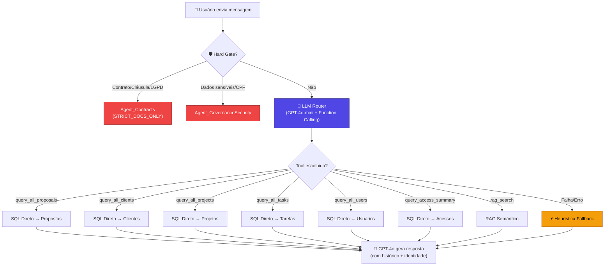
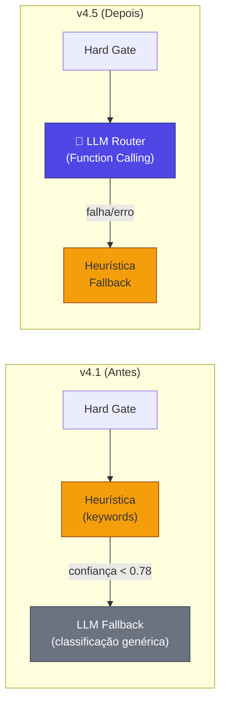
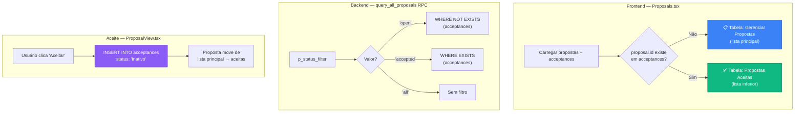
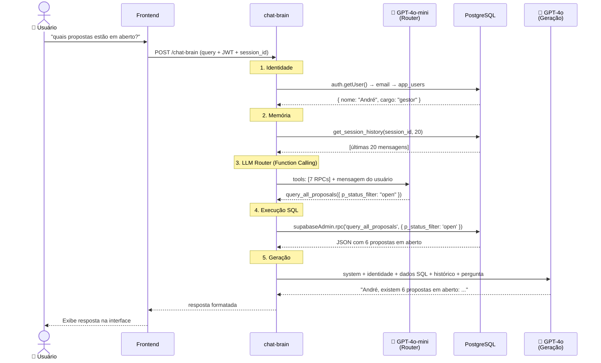
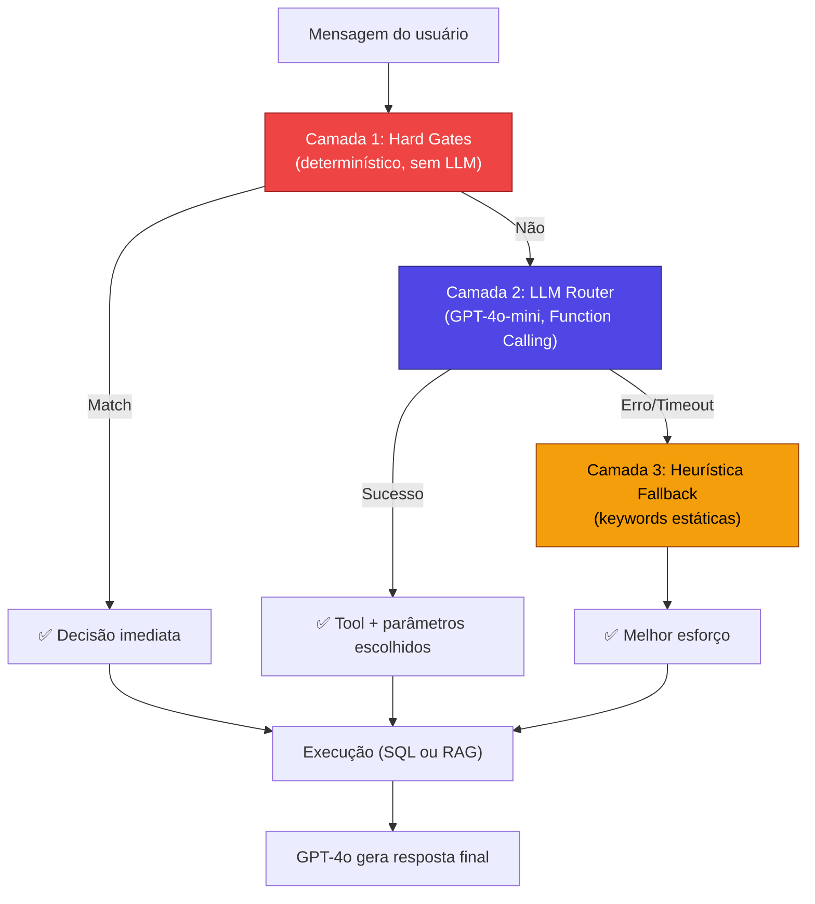
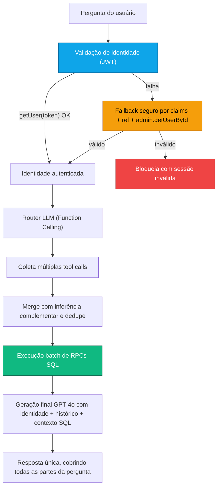

# Relatório Técnico v6.5: Consolidação Integral (v6.0 + Ciclo de Governança Normativa + Canário Operacional)

**Sistema "Segundo Cérebro" da C4 Marketing — 19 de Fevereiro de 2026**

Este documento mantém integralmente todo o conteúdo da versão 6.0 e adiciona, em detalhe operacional e técnico, tudo que foi implementado no ciclo seguinte, incluindo governança normativa do RAG, validação canário em produção, hotfixes de retrieval e automação de checklist.

Escopo desta consolidação:
1. Inclusão integral de `brain_tech_report_v6.0.md` (sem cortes).
2. Inclusão detalhada de mudanças de código executadas após v6.0.
3. Inclusão detalhada de migrations aplicadas, deploys, flags, testes e correções.

---

## Bloco Integral 1 - Conteúdo Original do Relatório v6.0 (sem resumo, sem cortes)

> A partir deste ponto, o conteúdo abaixo replica integralmente o relatório `brain_tech_report_v6.0.md`.

# Relatório Técnico v6.0: Consolidação Integral (v4.5 + v5.0 + Ajustes Pós-v5.0)

**Sistema "Segundo Cérebro" da C4 Marketing — 19 de Fevereiro de 2026**

Este documento foi produzido para consolidar, em um único artefato, o histórico técnico completo do Segundo Cérebro sem redução de conteúdo.

Escopo desta consolidação:

1. Inclusão integral do conteúdo do `brain_tech_report_v4.5.md`.
2. Inclusão integral do conteúdo do `brain_tech_report_v5.0.md`.
3. Inclusão minuciosa dos ajustes posteriores executados no ciclo de saneamento operacional e estabilização de memória cognitiva.

---

## Bloco Integral 1 - Conteúdo Original do Relatório v4.5 (sem resumo, sem cortes)

> A partir deste ponto, o conteúdo abaixo replica integralmente o relatório `brain_tech_report_v4.5.md`.

# Relatório Técnico v4.5: LLM Router Inteligente e Gestão de Propostas

**Sistema "Segundo Cérebro" da C4 Marketing — 17 de Fevereiro de 2026**

A versão 4.5 resolve a fragilidade fundamental do sistema de roteamento: **o agente dependia de listas de palavras-chave hardcoded** para decidir qual consulta executar. Agora ele usa **GPT-4o-mini com Function Calling** para entender o contexto semântico de qualquer pergunta em linguagem natural. Além disso, propostas aceitas são separadas das abertas em toda a stack.

---

## Linha do Tempo da Evolução

| Versão | Nome | Capacidade Principal |
|--------|------|---------------------|
| v1 | Chat RAG | Busca vetorial + filtro anti-eco |
| v2 | Agentic RAG | Router heurístico, 6 Agentes, ETL automático |
| v3 | Hybrid Intelligence | Tool Use (RAG + SQL direto) |
| v4.1 | Cognitive Agent | Identidade + Memória de Sessão + Cobertura Total |
| **v4.5** | **Semantic Router** | **LLM Router (Function Calling) + Gestão de Propostas** |

---

## Mudança Arquitetural Principal: De Keywords para Semântica

### O Problema (v2–v4.1)

O roteamento do sistema dependia de **listas de palavras-chave fixas** para decidir qual ferramenta usar:

```typescript
// ❌ Abordagem antiga (heurística)
if (hasAny(msg, ["aberta", "pendente", "aguardando"])) {
    statusFilter = 'open'  // ← e se o usuário disser "em aberto"?
}
```

Isso gerava falhas reais:

- **"quais propostas estão em aberto?"** → Palavra "aberto" não matchava com "aberta" → resposta errada
- **"quais propostas..."** → "quais" sozinho não era keyword de listagem → caía no RAG genérico
- **"tem tarefa pendente?"** → Sem "liste" ou "todos", não era detectado como listagem

Cada erro exigia adição manual de mais keywords, criando uma lista infinita e frágil.

### A Solução (v4.5): LLM Router com Function Calling

Em vez de keywords, o sistema agora usa **GPT-4o-mini como classificador inteligente**. O LLM recebe as ferramentas disponíveis (RPCs) como funções tipadas e **escolhe qual usar** com base na compreensão semântica da pergunta:

```typescript
// ✅ Abordagem nova (LLM Function Calling)
const completion = await openai.chat.completions.create({
    model: 'gpt-4o-mini',       // Rápido (~500ms) e barato (~$0.001/chamada)
    temperature: 0,              // Determinístico
    tools: availableTools,       // 7 ferramentas tipadas
    tool_choice: "required",     // Sempre escolhe uma
    messages: [
        { role: 'system', content: routerPrompt },
        { role: 'user', content: perguntaDoUsuario }
    ]
})
```

O LLM entende naturalmente que todas estas frases significam a mesma coisa:

- "quais propostas estão em aberto?"
- "me mostra as propostas que ainda não foram aceitas"
- "tem algum orçamento pendente?"
- "quantos negócios não fechamos ainda?"

→ Todas mapeiam para: `query_all_proposals({ p_status_filter: "open" })`

---

## 1. Arquitetura do LLM Router

### Diagrama de Fluxo: Roteamento v4.5



### Hierarquia de Decisão (v4.1 → v4.5)



**Inversão crítica**: Na v4.1, a heurística (keywords) era executada PRIMEIRO e o LLM era fallback. Na v4.5, o **LLM é executado PRIMEIRO** e a heurística é o fallback para resiliência.

---

## 2. Ferramentas Tipadas (Function Definitions)

O LLM Router recebe 7 ferramentas com **schemas JSON tipados**:

```
┌─────────────────────────┬────────────────────────────────────────────────────┐
│ Ferramenta              │ Parâmetros                                         │
├─────────────────────────┼────────────────────────────────────────────────────┤
│ query_all_proposals     │ p_status_filter: "all" | "open" | "accepted"      │
├─────────────────────────┼────────────────────────────────────────────────────┤
│ query_all_clients       │ p_status: "Ativo" | "Inativo" | "Suspenso" | ... │
├─────────────────────────┼────────────────────────────────────────────────────┤
│ query_all_projects      │ p_service_type: "traffic" | "website" | "lp"     │
│                         │ p_status_filter: "Ativo" | "Inativo"             │
├─────────────────────────┼────────────────────────────────────────────────────┤
│ query_all_tasks         │ p_project_id: number (opcional)                   │
│                         │ p_status: "backlog" | "in_progress" | "approval" │
│                         │ | "done" | "paused" (compat: todo/review)        │
│                         │ p_overdue: boolean (opcional)                     │
├─────────────────────────┼────────────────────────────────────────────────────┤
│ query_all_users         │ (sem parâmetros)                                  │
├─────────────────────────┼────────────────────────────────────────────────────┤
│ query_access_summary    │ (sem parâmetros)                                  │
├─────────────────────────┼────────────────────────────────────────────────────┤
│ rag_search              │ (busca semântica — documentos e contratos)        │
└─────────────────────────┴────────────────────────────────────────────────────┘
```

### Prompt do Router

O system prompt do LLM Router inclui **exemplos de mapeamento** para guiar a classificação:

```
"quais propostas estão em aberto?" → query_all_proposals(p_status_filter: "open")
"quem são nossos clientes ativos?" → query_all_clients(p_status: "Ativo")
"liste todos os projetos de tráfego" → query_all_projects(p_service_type: "traffic")
"quem acessou o sistema hoje?" → query_access_summary()
"o que diz o contrato com a empresa X?" → rag_search()
"tem alguma tarefa pendente?" → query_all_tasks(p_status: "backlog")
"quais tarefas estão atrasadas?" → query_all_tasks(p_overdue: true)
```

---

## 3. Gestão de Propostas: Open vs Accepted

### Problema Anterior

Todas as propostas apareciam em uma única lista. Não havia distinção visual entre propostas pendentes e aceitas, nem no frontend nem nas consultas do agente.

### Solução v4.5



### Mudanças por Arquivo

| Arquivo | Mudança |
|---------|---------|
| `ProposalView.tsx` | Aceite grava `status: 'Inativo'` na tabela `acceptances` |
| `Proposals.tsx` | Lista principal filtra `proposals.filter(p => !acceptances.some(...))` |
| `query_all_proposals` RPC | Novo parâmetro `p_status_filter` ('all', 'open', 'accepted') |
| `router.ts` | LLM Router seleciona filtro correto via function calling |

### SQL: RPC query_all_proposals (v4.5)

```sql
CREATE OR REPLACE FUNCTION public.query_all_proposals(
  p_status_filter text DEFAULT 'all'
)
RETURNS json
LANGUAGE plpgsql
SECURITY DEFINER
AS $$
BEGIN
  SELECT json_agg(p ORDER BY p.created_at DESC) INTO result
  FROM (
    SELECT p.*, 
      (SELECT count(*) FROM acceptances a WHERE a.proposal_id = p.id) > 0 AS was_accepted,
      (SELECT a.status FROM acceptances a WHERE a.proposal_id = p.id LIMIT 1) AS acceptance_status
    FROM proposals p
    WHERE
      (p_status_filter = 'all') OR
      (p_status_filter = 'open' AND NOT EXISTS (SELECT 1 FROM acceptances a WHERE a.proposal_id = p.id)) OR
      (p_status_filter = 'accepted' AND EXISTS (SELECT 1 FROM acceptances a WHERE a.proposal_id = p.id))
  ) p;
  RETURN COALESCE(result, '[]'::json);
END;
$$;
```

---

## 4. Limpeza de Parâmetros RPC

### Problema Detectado

Quando o LLM omitia um parâmetro opcional, o Function Calling às vezes enviava `null` ou `"null"` (string), causando erros silenciosos nas RPCs PostgreSQL.

### Solução: cleanParams

```typescript
const { rpc_name, ...rpcParams } = decision.db_query_params
// Limpar valores null/undefined/"null" antes de enviar ao PostgreSQL
const cleanParams: Record<string, any> = {}
for (const [k, v] of Object.entries(rpcParams)) {
    if (v !== null && v !== undefined && v !== 'null') cleanParams[k] = v
}
const { data, error } = await supabaseAdmin.rpc(rpc_name, cleanParams)
```

Isso garante que parâmetros com `DEFAULT NULL` nas RPCs sejam tratados como NULL real no PostgreSQL.

### Mensagem de Resultado Vazio Melhorada

```typescript
// ❌ Antes (v4.1) — GPT interpretava como "sem acesso"
contextText = 'Nenhum registro encontrado no banco de dados.'

// ✅ Agora (v4.5) — GPT entende que consultou mas não achou
contextText = `CONSULTA REALIZADA COM SUCESSO via ${rpc_name}, 
mas NENHUM registro foi encontrado. Informe ao usuário que a consulta 
foi feita no banco de dados e não há registros correspondentes no momento.`
```

---

## 5. Fluxo Completo (v4.5)



---

## 6. Comparativo Completo v1 → v4.5

| Dimensão | v1 | v2 | v3 | v4.1 | **v4.5** |
|----------|----|----|----|----- |----------|
| **Roteamento** | Nenhum | Keywords | Keywords + filtros | Keywords + LLM fallback | **🧠 LLM-first (Function Calling)** |
| **Identidade** | ❌ | ❌ | ❌ | ✅ Nome + Cargo | ✅ Nome + Cargo |
| **Memória** | ❌ | ❌ | ❌ | ✅ 20 msgs/sessão | ✅ 20 msgs/sessão |
| **Recuperação** | RAG puro | RAG + filtros | RAG + SQL | RAG + SQL + 6 RPCs | RAG + SQL + **7 RPCs tipadas** |
| **Propostas** | — | — | Lista única | Lista única | **Open vs Accepted** |
| **Robustez NLP** | — | Frágil | Frágil | Frágil (keywords) | **✅ Semântico (LLM)** |
| **Custo Router** | $0 | $0 | $0 | ~$0.03/chamada (GPT-4o) | **~$0.001/chamada (4o-mini)** |
| **Latência Router** | 0ms | 0ms | 0ms | ~2s (GPT-4o) | **~500ms (4o-mini)** |
| **Anti-alucinação** | Filtro tipo | Políticas | + SQL factual | + contexto real | + **resultado vazio explícito** |

---

## 7. Especificações Técnicas

- **Modelo de Geração**: GPT-4o (OpenAI)
- **Modelo de Roteamento**: GPT-4o-mini (Function Calling, temperature: 0)
- **Modelo de Embedding**: `text-embedding-3-small` (1536 dimensões)
- **Banco de Dados**: PostgreSQL 15 com `pgvector` + `pg_cron`
- **Infraestrutura**: Supabase Edge Functions (Deno)
- **RPCs**: 7 funções SQL (`query_all_projects`, `query_all_clients`, `query_all_proposals`, `query_all_users`, `query_all_tasks`, `query_access_summary`, `get_session_history`)
- **Contexto Multi-Turn**: Últimas 20 mensagens por sessão (~8.000 tokens)
- **Tabelas Cobertas**: 16 tabelas do schema `public` + 2 do schema `brain`
- **Custo estimado por consulta**: ~$0.004 (Router: $0.001 + Geração: $0.003)

---

## 8. Custo e Performance

### Comparativo de Custo do Router

| Versão | Modelo Router | Custo/chamada | Latência | Robustez |
|--------|--------------|---------------|----------|----------|
| v2–v4.1 | Heurística (keywords) | $0 | ~0ms | ❌ Frágil |
| v4.1 (fallback) | GPT-4o (JSON) | ~$0.03 | ~2.000ms | ⚠️ Médio |
| **v4.5** | **GPT-4o-mini (FC)** | **~$0.001** | **~500ms** | **✅ Robusto** |

### Estimativa de Custo Mensal

Considerando ~500 consultas/mês ao agente:

- **Router (GPT-4o-mini)**: 500 × $0.001 = **$0.50/mês**
- **Geração (GPT-4o)**: 500 × $0.003 = **$1.50/mês**
- **Total estimado**: **~$2.00/mês**

---

## 9. Resiliência: Três Camadas de Proteção



| Camada | Quando ativa | Latência | Exemplo |
|--------|-------------|----------|---------|
| **Hard Gate** | Contratos, dados sensíveis | 0ms | "qual a cláusula de rescisão?" |
| **LLM Router** | 95% das perguntas | ~500ms | "tem proposta pendente?" |
| **Heurística** | LLM falha ou timeout | 0ms | Fallback de segurança |

---

## 10. Impacto Prático

### Antes (v4.1) — Falha por keyword faltando

```
Usuário: "quais propostas estão em aberto?"
Router:  ❌ "quais" não era keyword → caiu no RAG genérico
Agente:  Retornou 3 propostas erradas (incluindo aceitas)

Usuário: "tem alguma tarefa pendente?"
Router:  ❌ "pendente" não era keyword de listagem
Agente:  "Não tenho acesso ao sistema de tarefas" (alucinação)
```

### Depois (v4.5) — Compreensão semântica

```
Usuário: "quais propostas estão em aberto?"
LLM:     ✅ query_all_proposals(p_status_filter: "open")
Agente:  Retornou as 6 propostas corretas em aberto

Usuário: "tem alguma tarefa pendente?"
LLM:     ✅ query_all_tasks(p_status: "backlog")
Agente:  "André, não há tarefas pendentes no momento." (resultado real)

Usuário: "me mostra os clientes que estão inativos"
LLM:     ✅ query_all_clients(p_status: "Inativo")
Agente:  Retornou lista precisa de clientes inativos
```

---

## 11. Arquivos Modificados

| Arquivo | Tipo | Mudança |
|---------|------|---------|
| `supabase/functions/chat-brain/index.ts` | Backend | LLM Router com Function Calling (GPT-4o-mini), cleanup de params, mensagem de vazio melhorada |
| `supabase/functions/_shared/agents/router.ts` | Backend | Prioridade invertida (LLM-first, heurística-fallback), keywords expandidas como backup |
| `pages/Proposals.tsx` | Frontend | Filtro visual: propostas aceitas separadas da lista principal |
| `pages/ProposalView.tsx` | Frontend | Status inicial de aceite definido como 'Inativo' |
| `supabase/migrations/20260217204000_update_proposals_rpc.sql` | Migração | RPC `query_all_proposals` com parâmetro `p_status_filter` |

---

## Conclusão

A v4.5 marca a transição do Segundo Cérebro de **sistema baseado em regras** para **sistema baseado em compreensão**. O roteamento por keywords era um ponto de falha silencioso — o sistema parecia funcionar até encontrar uma variação linguística não prevista. Com o LLM Router:

1. **Qualquer forma de perguntar** é compreendida — sinônimos, variações, contexto implícito
2. **Novos filtros** não exigem código — basta adicionar parâmetros na definição da tool
3. **Custo insignificante** — ~$0.001 por classificação com GPT-4o-mini
4. **Zero manutenção de keywords** — o LLM aprende novas formas naturalmente

O próximo passo natural é expandir o catálogo de tools disponíveis (ex: `query_financial_summary`, `create_task`, `update_project_status`), transformando o agente de **consultor passivo** em **executor de ações** no sistema.

---

## Bloco Integral 2 - Conteúdo Original do Relatório v5.0 (sem resumo, sem cortes)

> A partir deste ponto, o conteúdo abaixo replica integralmente o relatório `brain_tech_report_v5.0.md`.

# Relatório Técnico v5.0: Resiliência de Autenticação e Multi-Consulta SQL

**Sistema "Segundo Cérebro" da C4 Marketing — 19 de Fevereiro de 2026**

A versão 5.0 foi focada em sanear um incidente crítico de produção: o agente apresentava `Sessão inválida (JWT)` em cenários reais e, quando respondia, tratava perguntas compostas de forma parcial (consultando apenas 1 domínio por mensagem).

O v5.0 introduz duas mudanças estruturais:

- **Autenticação resiliente** no `chat-brain` (com fallback seguro por claims JWT e validação de projeto).
- **Execução multi-RPC por mensagem** para consultas compostas (tarefas + usuários + projetos etc.) em um único ciclo de resposta.
- **Memória explícita persistente**: comandos de “salvar/guardar para o futuro” agora gravam no banco vetorial (`brain.documents`) com metadados estruturados.

---

## Linha do Tempo da Evolução

| Versão | Nome | Capacidade Principal |
|--------|------|---------------------|
| v1 | Chat RAG | Busca vetorial + filtro anti-eco |
| v2 | Agentic RAG | Router heurístico, 6 agentes, ETL automático |
| v3 | Hybrid Intelligence | Tool use (RAG + SQL direto) |
| v4.1 | Cognitive Agent | Identidade + memória de sessão + cobertura total |
| v4.5 | Semantic Router | LLM Router (Function Calling) + gestão de propostas |
| **v5.0** | **Resilient Cognitive Router** | **JWT resiliente + Multi-RPC SQL + resposta composta confiável** |

---

## 1. Incidente de Produção (Fev/2026)

### Sintomas observados

- Mensagens recorrentes: `Falha de integração... Sessão inválida (JWT)`.
- Perda de continuidade de identidade em alguns fluxos.
- Respostas parciais para perguntas compostas.
- Respostas alucinatórias de "não tenho acesso ao sistema/banco", mesmo com RPCs disponíveis.

### Causas-raiz

- O pipeline de roteamento/execução SQL estava preso ao conceito de **uma única tool por pergunta**.
- Em cenários de sessão/token inconsistente, a autenticação no `chat-brain` falhava cedo e o fluxo encerrava.

---

## 2. Arquitetura v5.0



---

## 3. Resiliência JWT (Camada de Autenticação)

### Estratégia aplicada

- O `chat-brain` passou a validar token explicitamente com `auth.getUser(authToken)`.
- Se `getUser` falhar, entra fallback controlado:
- Decodifica claims JWT localmente.
- Compara `ref` do token com o `project ref` esperado.
- Reaproveita `sub` como `userId` somente se o `ref` for compatível.
- Enriquecimento opcional por `auth.admin.getUserById(sub)`.
- Enriquecimento de perfil em `app_users` por e-mail (`ilike` + `maybeSingle`).
- Se nada validar, mantém comportamento fail-closed com resposta de sessão inválida.

### Resultado prático

- Eliminou bloqueio indevido em cenários com token local inconsistente.
- Preservou segurança por checagem de `project ref` antes de aceitar claims fallback.

---

## 4. Multi-Consulta SQL na Mesma Pergunta (Batch RPC)

### Problema anterior

- O Router selecionava apenas uma ferramenta por mensagem.
- Perguntas compostas perdiam parte da intenção.

### Solução v5.0

- O prompt do Router passou a permitir **múltiplas function calls** para perguntas compostas.
- O backend parseia **todas** as `tool_calls`.
- Aplica inferência complementar por intenção (`tarefas`, `usuários`, `projetos`, `clientes`, `propostas`, `acessos`).
- Faz deduplicação por chave (`rpc_name + params`).
- Executa lote de RPCs sequencialmente.
- Consolida o contexto final para geração única.
- Retorna telemetria em `meta.executed_db_rpcs`.

### Exemplo suportado

Pergunta:

`"quais sao as tarefas do lucas, quantos usuários temos cadastrados no sistema e quantos projetos ativos?"`

Execução esperada:

- `query_all_tasks(...)`
- `query_all_users()`
- `query_all_projects(...)`

---

## 5. Blindagem Contra Resposta Alucinatória

Foram adicionadas regras explícitas no prompt de geração:

- Se a fonte for SQL direta, o modelo não pode responder "preciso saber qual sistema/banco".
- Perguntas com múltiplas partes devem ser respondidas em blocos correspondentes.
- Resultado vazio permanece explícito como `consulta realizada com sucesso, mas sem registros`.
- Em perguntas de liderança/cargo (CEO, presidente etc.), o sistema consulta SQL + memória vetorial e prioriza fatos explícitos salvos pelo usuário.

---

## 5.1 Regra de Memória Explícita

Quando o usuário envia instruções como:

- "guarde isso para o futuro..."
- "salve essa informação..."
- "lembre que..."

o `chat-brain`:

- Extrai o fato da frase.
- Gera embedding (`text-embedding-3-small`).
- Persiste no vetor via `insert_brain_document`.
- Marca metadados como `source_table = user_facts`, `source = explicit_user_memory`, `fact_kind = user_asserted`.
- Retorna confirmação determinística de gravação.

---

## 6. Memória e Identidade (Continuidade Cognitiva)

Mantido e reforçado no v5.0:

- Histórico de sessão com `get_session_history(session_id, 20)`.
- Memória entre sessões com `get_user_recent_history(user_id, limit, exclude_session_id)`.
- Fallback determinístico para perguntas de memória sem registros.
- Injeção de identidade no prompt com:
- Nome.
- E-mail.
- Cargo.
- `Auth User ID` (rastreabilidade contextual).

---

## 7. Ajustes de Cliente (Frontend)

No `lib/brain.ts`:

- O pré-check `supabase.auth.getUser(token)` deixou de abortar a chamada quando falha localmente.
- Agora registra warning e delega a validação final ao `chat-brain` (fonte de verdade).
- Permanece proteção de mismatch de projeto (`ref`) e renovação de sessão em erro de JWT.

---

## 8. Migrações e Saneamento de Banco (Ciclo v5.0)

Durante o saneamento foram consolidados:

- `20260219130000_fix_memory_history_and_match_status.sql`
- Inclui `get_user_recent_history`.
- Ajusta fallback de `metadata.status` em `match_brain_documents`.
- `20260219141000_add_attachments_column_safe.sql`
- Migração idempotente para coluna `attachments`.
- Reparos em histórico de migração (`schema_migrations`) para eliminar conflitos de versões duplicadas.

---

## 9. Snapshot Operacional (19/02/2026)

- Projeto Supabase: `xffdrdoaysxfkpebhywl`.
- Edge Function `chat-brain`: ativa com deploy v5.0.
- Modo de função: `verify_jwt = false` no gateway e autenticação validada internamente no handler.
- Resultado validado em produção: fluxo voltou a responder e consultar dados estruturados.

---

## 10. Comparativo v4.5 vs v5.0

| Dimensão | v4.5 | **v5.0** |
|----------|------|----------|
| Roteamento de intenção | 1 tool principal por pergunta | **Múltiplas tools por pergunta composta** |
| Execução SQL | RPC única por ciclo | **Batch de RPCs com dedupe** |
| JWT em sessão inconsistente | Suscetível a falha total | **Fallback resiliente com validação de ref/sub** |
| Identidade em falha parcial de auth | Pode degradar para anônimo | **Recuperação por claims + admin lookup** |
| Resposta a perguntas compostas | Parcial/intermitente | **Cobertura integral em uma resposta** |
| Anti-alucinação de acesso | Parcial | **Regra explícita: não negar acesso quando SQL já executou** |
| Telemetria de execução | Limitada | **`meta.executed_db_rpcs`** |

---

## 11. Arquivos Atualizados no v5.0

| Arquivo | Tipo | Mudança |
|---------|------|---------|
| `supabase/functions/chat-brain/index.ts` | Backend | Auth resiliente (JWT fallback seguro), Router multi-tool, batch RPC, dedupe, telemetria `executed_db_rpcs`, reforço de prompt |
| `lib/brain.ts` | Frontend | Pré-check de auth não bloqueante, mantendo validação final no backend |
| `supabase/migrations/20260219130000_fix_memory_history_and_match_status.sql` | Migração | Memória cross-session + ajuste de retrieval status |
| `supabase/migrations/20260219141000_add_attachments_column_safe.sql` | Migração | Migração idempotente de anexos |

---

## 12. Conclusão

O v5.0 fecha o ciclo de estabilização do Segundo Cérebro em produção:

- Resolve o incidente de sessão/JWT sem sacrificar segurança contextual.
- Remove a limitação de consulta única e habilita respostas compostas confiáveis.
- Mantém identidade e memória como pilares centrais da experiência.
- Aumenta rastreabilidade operacional com metadados de execução SQL.

Próximo passo natural:

- Adicionar métricas estruturadas por `rpc_name` (latência, taxa de erro, cardinalidade de resposta) para observabilidade contínua do agente em produção.

---

## Bloco 3 - Ajustes Pós-v5.0 (Histórico Minucioso e Operacional)

### 3.1 Contexto do incidente observado em produção

No ciclo posterior ao v5.0, foram observados os seguintes comportamentos reais no chat do Segundo Cérebro:

1. Erros de integração com JWT, com mensagens como:

- `Falha de integração com o Segundo Cérebro. Detalhes: Invalid JWT`
- `Falha de integração com o Segundo Cérebro. Detalhes: Sessão inválida (JWT). Faça login novamente.`
- `Falha de integração com o Segundo Cérebro. Detalhes: Sessão inválida (JWT). Projeto esperado: xffdrdoaysxfkpebhywl; token: xffdrdoaysxfkpebhywl; role: authenticated; sub: 321f03b7-4b78-41f5-8133-6967d6aea169.`

1. Perda aparente de identidade contextual (agente respondendo que não sabia com quem conversava).

2. Perda aparente de memória funcional e de resposta integrada com bases da empresa.

3. Em casos de memória explícita, confirmação de gravação sem recuperação imediata na pergunta seguinte para alguns termos (exemplo reportado: CTO).

4. Em alguns testes de widget lateral, mensagens com negação de capacidade de armazenar informações, contrariando o requisito de memória contínua do produto.

Esses sintomas direcionaram um ciclo de correções incrementais, com foco em:

- robustez de autenticação;
- persistência de memória explícita e cognitiva;
- consulta obrigatória às bases antes da resposta;
- redução de respostas alucinatórias sobre indisponibilidade de dados.

---

### 3.2 Saneamento de migrations (incidente de versão duplicada)

Erro operacional registrado durante execução de migration:

- `ERROR: duplicate key value violates unique constraint "schema_migrations_pkey" (SQLSTATE 23505)`
- `Key (version)=(20240201) already exists.`

Interpretação técnica:

1. O banco remoto já possuía a versão `20240201` em `supabase_migrations.schema_migrations`.
2. A migration local tentou reaplicar a mesma versão, gerando conflito de chave primária.
3. Parte do SQL era idempotente (coluna já existente), mas o registro de versionamento não era.

Ações de saneamento documentadas e executadas no ciclo:

1. Inventário de migrations e conferência de divergência remota/local.
2. Dry-run de push para evitar reexecução destrutiva.
3. Isolamento de migration antiga conflitante para área de legado quando necessário.
4. Plano de rebaseline formalizado em `docs/migration_sanitation_plan.md`.

Comandos utilizados no ciclo:

```powershell
npx supabase migration list --workdir .
npx supabase migration list --linked --workdir .
npx supabase db push --linked --dry-run --workdir .
Get-ChildItem supabase/migrations -File | ForEach-Object { if ($_.BaseName -match '^([0-9]+)_') { [PSCustomObject]@{Version=$matches[1];Name=$_.Name} } } | Group-Object Version | Where-Object {$_.Count -gt 1}
Move-Item supabase/migrations/20260219_add_attachments_column.sql supabase/migrations_legacy/20260219_add_attachments_column.sql -Force
```

---

### 3.3 Ajustes estruturais no `chat-brain` após v5.0

Arquivo principal alterado: `supabase/functions/chat-brain/index.ts`

#### 3.3.1 Robustez de autenticação e identidade

O pipeline de autenticação permaneceu com os mecanismos de resiliência introduzidos no v5.0 e foi mantido no ciclo de estabilização:

1. Tentativa primária de autenticação por:

```ts
client.auth.getUser(authToken)
```

1. Fallback de claims quando necessário:

- `decodeJwtPayload(token)`
- extração de `sub`, `role`, `ref`;
- validação de `ref` contra projeto esperado derivado de `SUPABASE_URL`.

1. Enriquecimento por admin API (quando claims são aceitas):

```ts
supabaseAdmin.auth.admin.getUserById(tokenSub)
```

1. Enriquecimento de perfil em `app_users` via e-mail (`ilike + maybeSingle`).

2. Fail-closed quando não há identidade válida:

- resposta de sessão inválida;
- não processa fluxo cognitivo como usuário anônimo.

Referências de implementação (linhas atuais):

- `supabase/functions/chat-brain/index.ts:41`
- `supabase/functions/chat-brain/index.ts:51`
- `supabase/functions/chat-brain/index.ts:64`
- `supabase/functions/chat-brain/index.ts:96`
- `supabase/functions/chat-brain/index.ts:117`
- `supabase/functions/chat-brain/index.ts:134`

---

#### 3.3.2 Memória explícita (persistência vetorial por comando do usuário)

Fluxo mantido e reforçado para intents como "guarde", "salve", "registre", "memorize", "lembre".

Etapas de execução:

1. Detecta intenção explícita (`isExplicitMemorySaveIntent`).
2. Extrai fato objetivo (`extractMemoryFactText`) removendo prefixos linguísticos e ruído.
3. Gera embedding com `text-embedding-3-small`.
4. Persiste via RPC `insert_brain_document` com metadados estruturados.

Metadados gravados para fato explícito:

- `type: session_summary`
- `status: active`
- `artifact_kind: unknown`
- `source_table: user_facts`
- `source: explicit_user_memory`
- `tenant_id` / `user_id`
- `session_id`
- `fact_kind: user_asserted`
- `created_by: chat-brain`
- `saved_at`

Referências de implementação:

- `supabase/functions/chat-brain/index.ts:303`
- `supabase/functions/chat-brain/index.ts:313`
- `supabase/functions/chat-brain/index.ts:351`

---

#### 3.3.3 Expansão de C-level no roteamento e recuperação

Foi reforçada a cobertura semântica de liderança para evitar perda de recuperação em termos além de CEO.

Termos cobertos no ciclo atual:

- `ceo`, `cto`, `cfo`, `coo`, `cmo`, `cio`
- `cargo`, `função`, `papel`
- `presidente`, `fundador`, `dono`, `diretor executivo`

Aplicações da expansão:

1. Heurística suplementar de consultas SQL (`inferSupplementalDbCalls`).
2. Flag de `isLeadershipQuery`.
3. Regex de priorização de fato explícito salvo no vetor.
4. Exemplos do prompt do Router para orientar `query_all_users()`.

Referências:

- `supabase/functions/chat-brain/index.ts:230`
- `supabase/functions/chat-brain/index.ts:710`
- `supabase/functions/chat-brain/index.ts:891`
- `supabase/functions/chat-brain/index.ts:897`

---

#### 3.3.4 Memória viva cognitiva (novo reforço pós-v5.0)

Este foi o ajuste central do ciclo atual para atender ao requisito de "guardar todo e qualquer tipo de dado" no chat.

Mudança implementada:

1. Foi criada gravação automática de memória cognitiva em todo turno.
2. A gravação ocorre tanto para mensagem de usuário quanto para resposta do assistente.
3. A falha de gravação não derruba o chat (wrapper seguro).
4. Eventos de escrita são expostos em telemetria (`memory_write_events`).

Implementação atual:

- Função de gravação cognitiva:
  - `persistCognitiveChatMemory(role, content, stage)`
- Wrapper resiliente:
  - `persistCognitiveMemorySafe(...)`
- Gravação inbound:
  - `await persistCognitiveMemorySafe('user', query, 'user_message_inbound')`
- Gravação outbound:
  - `await persistCognitiveMemorySafe('assistant', answer, 'assistant_answer_outbound')`

Metadados do log cognitivo:

- `type: chat_log`
- `status: active`
- `artifact_kind: unknown`
- `source_table: chat_messages`
- `source: cognitive_live_memory`
- `tenant_id` / `user_id`
- `session_id`
- `role` (`user` ou `assistant`)
- `created_by: chat-brain`
- `saved_at`

Referências:

- `supabase/functions/chat-brain/index.ts:388`
- `supabase/functions/chat-brain/index.ts:432`
- `supabase/functions/chat-brain/index.ts:446`
- `supabase/functions/chat-brain/index.ts:1217`
- `supabase/functions/chat-brain/index.ts:1228`

---

#### 3.3.5 Consulta cognitiva obrigatória antes da resposta

Para evitar respostas desconectadas do histórico e dos fatos salvos, foi adicionado um guardrail global:

1. Sempre executar busca vetorial cognitiva antes da geração final.
2. Recuperar `chat_log` + `session_summary` do mesmo `tenant_id`/usuário.
3. Extrair fatos explícitos relevantes para reforço no prompt.
4. Injetar no system prompt:

- `FATOS EXPLÍCITOS SALVOS PELO USUÁRIO`
- `MEMÓRIA COGNITIVA RELEVANTE`

Referências:

- `supabase/functions/chat-brain/index.ts:985`
- `supabase/functions/chat-brain/index.ts:1099`
- `supabase/functions/chat-brain/index.ts:1142`
- `supabase/functions/chat-brain/index.ts:1148`
- `supabase/functions/chat-brain/index.ts:1162`

---

#### 3.3.6 Reforço de prompt anti-negação de memória

O bloco de estilo obrigatório recebeu regras explícitas para bloquear resposta de "não consigo armazenar" quando houver contexto de memória no prompt.

Trecho de política aplicada:

- O sistema possui memória cognitiva ativa.
- O assistente não deve negar capacidade de memória quando há registros.
- O assistente deve considerar sempre os blocos de memória/fatos explícitos antes de concluir.

Referência:

- `supabase/functions/chat-brain/index.ts:1114`
- `supabase/functions/chat-brain/index.ts:1115`

---

### 3.4 Deploy e estado atual de execução

Deploy de função realizado no ciclo atual:

```powershell
npx supabase functions deploy chat-brain --project-ref xffdrdoaysxfkpebhywl --no-verify-jwt --workdir .
```

Resultado operacional:

- deploy concluído com sucesso;
- assets enviados (`chat-brain` e módulos `_shared`);
- aviso de Docker local não bloqueante para deploy remoto.

Verificação de estado:

```powershell
npx supabase functions list --workdir . -o json
```

Snapshot confirmado:

- projeto: `xffdrdoaysxfkpebhywl`
- função: `chat-brain`
- `status`: `ACTIVE`
- `verify_jwt`: `false`
- `version`: `43`

Observação:

- O comando `npx supabase functions logs chat-brain --workdir .` não foi aceito pela versão do CLI presente no ambiente (subcomando indisponível), portanto a validação foi feita por deploy + listagem da função e testes funcionais no chat.

---

### 3.5 Telemetria adicionada no payload de resposta

No retorno da função, `meta` passou a carregar campos úteis para observabilidade de memória no ciclo de conversa:

- `executed_db_rpcs`: lista de RPCs SQL efetivamente executadas.
- `cognitive_memory_docs`: quantidade de documentos cognitivos recuperados para a pergunta.
- `memory_write_events`: eventos de escrita de memória por estágio (ok/erro + detalhe).

Referência:

- `supabase/functions/chat-brain/index.ts:1226`
- `supabase/functions/chat-brain/index.ts:1227`
- `supabase/functions/chat-brain/index.ts:1228`

---

### 3.6 Cenários de validação funcional (roteiro de aceite)

#### Cenário A - Memória explícita + recuperação factual imediata

1. Enviar: `guarde essa informação: O CTO da empresa é o Celso Ferretia`.
2. Esperado:

- confirmação de gravação no cérebro;
- `meta.memory_saved = true`.

3. Perguntar: `quem é o CTO da C4?`.
2. Esperado:

- resposta baseada no fato explícito salvo (sem alucinação, sem negar acesso).

#### Cenário B - Memória viva sem comando explícito

1. Enviar uma informação factual sem "guarde/salve":

- `Nosso fornecedor principal de mídia é a Empresa X`.

2. Em seguida perguntar:

- `qual fornecedor principal de mídia eu te falei?`

3. Esperado:

- recuperação via memória cognitiva (`chat_log`) mesmo sem comando explícito de persistência.

#### Cenário C - Pergunta composta com múltiplos domínios

1. Perguntar:

- `quais as tarefas do Lucas, quantos usuários temos cadastrados e quantos projetos ativos?`

2. Esperado:

- execução multi-RPC;
- `meta.executed_db_rpcs` contendo chamadas de tarefas + usuários + projetos;
- resposta em blocos sem omissão de partes.

#### Cenário D - Continuidade de identidade

1. Usuário autenticado envia pergunta pessoal:

- `você sabe com quem está falando?`

2. Esperado:

- resposta ancorada na identidade injetada (`Nome`, `Email`, `Cargo`, `Auth User ID`), sem queda para modo anônimo.

---

### 3.7 Limitações e pendências técnicas registradas

1. `deno` não estava disponível no ambiente local durante este ciclo, então `deno check --no-remote` não pôde ser executado localmente.
2. A inspeção de logs por CLI depende da versão do supabase CLI com suporte ao subcomando específico de logs.
3. Apesar da memória viva implantada, recomenda-se monitorar cardinalidade de `chat_log` e política de retenção para evitar crescimento não controlado do vetor.
4. Recomenda-se adicionar métricas persistentes por estágio de escrita (`user_message_inbound`, `assistant_answer_outbound`, etc.) para dashboard operacional contínuo.

---

### 3.8 Arquivos impactados no ciclo pós-v5.0

1. `supabase/functions/chat-brain/index.ts`

- reforço de autenticação resiliente (mantido e validado);
- expansão de termos C-level;
- persistência automática de memória cognitiva (inbound/outbound);
- consulta obrigatória de memória cognitiva por pergunta;
- reforço de prompt para bloquear negação de memória;
- telemetria de memória no `meta`.

1. `docs/migration_sanitation_plan.md`

- plano de saneamento de conflitos de migration versionada.

1. `docs/brain_tech_report_v6.0.md` (este documento)

- consolidação integral e histórica sem cortes.

---

### 3.9 Checklist de aceite para este ciclo

1. `chat-brain` ativo em produção no projeto correto (`xffdrdoaysxfkpebhywl`).
2. Deploy aplicado com `verify_jwt=false` no gateway e validação interna no handler.
3. Salvamento explícito no vetor operacional.
4. Memória cognitiva automática em cada turno operacional.
5. Consulta cognitiva obrigatória antes da resposta operacional.
6. Prompt com guardrail anti-negação de memória operacional.
7. Telemetria `memory_write_events` e `cognitive_memory_docs` exposta no retorno.

---

## Encerramento do v6.0

Este artefato consolida integralmente os conteúdos v4.5 e v5.0 e adiciona, de forma minuciosa, o histórico de saneamento e ajustes aplicados até o estado atual do Segundo Cérebro.

---

## Bloco 2 - Ajustes Pós-v6.0 (Detalhamento Minucioso)

### 2.1 Objetivo do ciclo pós-v6.0

Após a consolidação da v6.0, o objetivo foi elevar o sistema para um estado de **governança normativa ativa**, sem romper a operação em produção.

Metas implementadas neste ciclo:

1. Formalizar governança de documentos no RAG:
- versionamento;
- documento vigente (`is_current`);
- hierarquia de autoridade (`policy > procedure/contract > memo > conversation`);
- invalidação automática de embeddings obsoletos.

2. Implementar rollout seguro:
- feature flags para ativação gradual;
- fallback operacional para evitar indisponibilidade;
- validação canário em endpoint real.

3. Entregar automação de validação:
- script único com teste de saúde, multi-RPC, memória explícita e hierarquia normativa.

---

### 2.2 Mudanças arquiteturais implementadas

#### 2.2.1 Retrieval policy normativa (`NORMATIVE_FIRST`)

Foi introduzida nova política de retrieval para consultas documentais com prioridade normativa.

Regra aplicada:

1. Usa base documental (não chat_log) com filtro de governança:
- `status = active`
- `is_current = true`
- `searchable = true`
- vigência válida (`effective_from <= now <= effective_to` quando `effective_to` existe)
- `authority_rank_min` (padrão 50)

2. Ordenação com prioridade normativa:
- maior autoridade primeiro;
- vigente/corrente primeiro;
- similaridade semântica em seguida.

3. Fail-open operacional:
- se `NORMATIVE_FIRST` retornar vazio, o `chat-brain` faz fallback para `STRICT_DOCS_ONLY` para evitar respostas quebradas.

Arquivos impactados:
- `supabase/functions/_shared/brain-types.ts`
- `supabase/functions/_shared/brain-retrieval.ts`
- `supabase/functions/_shared/agents/router.ts`
- `supabase/functions/chat-brain/index.ts`

#### 2.2.2 Feature flags de ativação gradual

Ativação por segredo de ambiente:

1. `BRAIN_NORMATIVE_GOVERNANCE_ENABLED`
- quando `true`, `chat-brain` tenta `NORMATIVE_FIRST` em consultas vetoriais documentais;
- quando `false` (ou ausente), mantém comportamento legado.

2. `BRAIN_VERSIONED_PUBLISH_ENABLED`
- quando `true`, `embed-content` usa `publish_brain_document_version`;
- se RPC não existir, fallback automático para `insert_brain_document`.

#### 2.2.3 Publicação versionada no ingest

`brain-sync` e `embed-content` foram alterados para suportar publicação versionada sem risco:

1. Tenta publicar com `publish_brain_document_version`.
2. Em ausência da RPC (ambiente sem migration), faz fallback para `insert_brain_document`.
3. Mantém compatibilidade retroativa.

---

### 2.3 Migrations criadas e aplicadas neste ciclo

#### 2.3.1 `20260219195000_normative_rag_governance.sql`

Conteúdo principal:

1. Função de ranking de autoridade:
- `public.brain_authority_rank(text)`
- mapeamento:
  - `policy = 100`
  - `procedure = 90`
  - `contract = 80`
  - `memo = 60`
  - `conversation = 20`
  - default = `50`

2. Parser seguro de datas em metadata:
- `public.try_parse_timestamptz(text)`

3. Publicação versionada:
- `public.publish_brain_document_version(...)`
- cria/normaliza:
  - `document_key`
  - `version`
  - `status`
  - `is_current`
  - `searchable`
  - `authority_type`
  - `authority_rank`
  - `effective_from`
  - `effective_to` (quando houver)
  - `content_hash`
- supersede versão anterior ativa quando `p_replace_current = true`.

4. Invalidação por função:
- `public.invalidate_obsolete_brain_embeddings(...)`
- marca documentos obsoletos como `searchable=false`.

5. Upgrade de retrieval:
- `public.match_brain_documents(...)` com campos normativos opcionais em `filters`.

6. Índices auxiliares:
- `document_key`
- `status`
- `is_current`
- `authority_type`
- `(source_table, source_id)`

7. Grants de execução para `authenticated` e `service_role`.

Observações do ciclo de aplicação:

1. Correção de tipo vetorial na assinatura (`extensions.vector(1536)`).
2. Correção do operador de distância com schema qualificado:
- `OPERATOR(extensions.<=>)`

#### 2.3.2 `20260219201000_auto_invalidate_obsolete_embeddings_trigger.sql`

Implementado trigger automático:

1. Função:
- `public.brain_documents_auto_invalidate()`

2. Trigger:
- `trg_brain_documents_auto_invalidate`
- `BEFORE INSERT OR UPDATE ON brain.documents`

3. Comportamento:
- se `status in ('superseded','revoked','archived')` ou `is_current=false`:
  - força `searchable=false`;
  - registra `invalidated_at`.

#### 2.3.3 `20260219203000_cleanup_canary_memory_artifacts.sql`

Limpeza de artefatos de teste intermediário de memória canário:
- remove entradas específicas com marcador `POLITICA_CANARIO_20260219` e pergunta de inspeção.

#### 2.3.4 `20260219204500_fix_match_brain_documents_json_null_filters.sql`

Hotfix crítico de retrieval após ativação canário.

Problema corrigido:

1. `filters->'source_table'` e outros campos chegavam como JSON `null` (não SQL `NULL`), gerando filtragem indevida.
2. Efeito: falso negativo de recuperação (documentos existentes não retornavam).

Correção aplicada:

1. Normalização explícita no CTE `params`:
- `NULLIF(filters->'source_table', 'null'::jsonb)`
- `NULLIF(filters->'type_allowlist', 'null'::jsonb)`
- `NULLIF(filters->'type_blocklist', 'null'::jsonb)`
- `NULLIF(filters->'authority_allowlist', 'null'::jsonb)`

Resultado:
- recuperação vetorial voltou a retornar documentos vigentes corretamente.

#### 2.3.5 `20260219210000_cleanup_normative_canary_docs.sql`

Limpeza final dos documentos canário normativos usados na validação:
- `CANARIO_NORMATIVE_20260219`
- `CANARIO_EFFECTIVE_2020`
- `CANARIO_INSERT_CHECK_20260219`
- marcadores de código legado/vigente de teste.

---

### 2.4 Alterações detalhadas por arquivo de função

#### 2.4.1 `supabase/functions/_shared/brain-types.ts`

Mudanças:

1. Novo `RetrievalPolicy`:
- `NORMATIVE_FIRST`

2. Novos campos opcionais em `MatchFilters`:
- `normative_mode?: boolean`
- `require_current?: boolean`
- `require_searchable?: boolean`
- `authority_rank_min?: number | null`

#### 2.4.2 `supabase/functions/_shared/brain-retrieval.ts`

Mudanças:

1. Política `NORMATIVE_FIRST` em `applyPolicy(...)`:
- força `status='active'`;
- força modo normativo;
- exige current/searchable;
- define `authority_rank_min` default 50;
- mantém bloqueio de `chat_log`.

#### 2.4.3 `supabase/functions/_shared/agents/router.ts`

Mudanças:

1. Suporte a `NORMATIVE_FIRST` em `applyPolicyToFilters(...)`.
2. Expansão de termos C-level em heurística de usuários:
- `ceo`, `cto`, `cfo`, `coo`, `cmo`, `cio`.

#### 2.4.4 `supabase/functions/chat-brain/index.ts`

Mudanças:

1. Feature flag:
- leitura de `BRAIN_NORMATIVE_GOVERNANCE_ENABLED`.

2. `runVectorRetrieval(...)` com `forcedPolicy` e fluxo canário:
- tenta `NORMATIVE_FIRST` quando aplicável;
- fallback para `STRICT_DOCS_ONLY` se vazio (fail-open).

3. Memória cognitiva:
- retrieval de memória alterado para `CHAT_ONLY`.

4. Prompt reforçado:
- regra explícita de conflito normativo com precedência `policy > procedure/contract > memo > conversa`.

5. Metadados de memória enriquecidos:
- memória explícita salva com `authority_type='memo'`, `authority_rank=60`, `is_current=true`, `searchable=true`.
- memória cognitiva com `authority_type='conversation'`, `authority_rank=20`, `searchable=true`.

6. Telemetria:
- `meta.normative_governance_enabled` retornado na resposta.

#### 2.4.5 `supabase/functions/brain-sync/index.ts`

Mudanças:

1. Introduzido `upsertVersionedBrainDocument(...)`.
2. Publicação via `publish_brain_document_version` com fallback para `insert_brain_document`.
3. Metadata de ingest oficial inclui `authority_type='policy'`.

#### 2.4.6 `supabase/functions/embed-content/index.ts`

Mudanças:

1. Feature flag `BRAIN_VERSIONED_PUBLISH_ENABLED`.
2. Publicação versionada quando ativa.
3. Fallback automático para `insert_brain_document` em ausência de RPC.
4. `effective_from` normalizado quando não informado.

---

### 2.5 Deploys e estado operacional

Deploys executados no projeto `xffdrdoaysxfkpebhywl`:

1. `chat-brain`
2. `brain-sync`
3. `embed-content`

Snapshot de funções após ciclo:

1. `chat-brain`: `ACTIVE`, `verify_jwt=false`, versão observada no ciclo: `46`.
2. `brain-sync`: `ACTIVE`, `verify_jwt=false`, versão observada no ciclo: `9`.
3. `embed-content`: `ACTIVE`, `verify_jwt=false`, versão observada no ciclo: `8`.

Flags ativas em produção ao final do ciclo:

1. `BRAIN_NORMATIVE_GOVERNANCE_ENABLED=true`
2. `BRAIN_VERSIONED_PUBLISH_ENABLED=true`

---

### 2.6 Validação canário - execução manual detalhada

#### 2.6.1 Rodada inicial

Foram executadas perguntas reais contra endpoint da função com token sintético no mesmo `project ref`.

Resultados observados:

1. Flag normativa ativa no runtime (`meta.normative_governance_enabled=true`).
2. Multi-RPC operacional (`query_all_users` + `query_all_projects`).
3. Salvamento explícito de memória operacional.
4. Em parte das consultas normativas documentais, ocorreram falsos negativos.

#### 2.6.2 Causa-raiz identificada

Falso negativo de retrieval por filtro JSON `null`:

1. `source_table: null` e campos similares estavam presentes como `jsonb null`.
2. A função tratava de forma inadequada em alguns caminhos de filtro.
3. Consequência: documentos válidos não retornavam mesmo após ingest.

#### 2.6.3 Hotfix aplicado

Migration corretiva:
- `20260219204500_fix_match_brain_documents_json_null_filters.sql`

Após o hotfix:

1. consulta documental retornou código vigente de teste (`ATIVO_2020`).
2. consulta de hierarquia normativa respondeu com precedência correta (`policy`).
3. consulta operacional SQL composta permaneceu íntegra.

#### 2.6.4 Limpeza de artefatos

Para não contaminar produção com dados de teste, foram aplicadas migrations de limpeza:

1. `20260219203000_cleanup_canary_memory_artifacts.sql`
2. `20260219210000_cleanup_normative_canary_docs.sql`

---

### 2.7 Automação de checklist canário

Arquivo criado:
- `scripts/check_brain_canary.js`

Objetivo:
- executar validação com 1 comando:

```powershell
node scripts/check_brain_canary.js
```

Testes implementados:

1. Integração + flag normativa.
2. Pergunta composta (multi-RPC).
3. Salvamento de memória explícita.
4. Recuperação imediata de memória (best effort, não crítico).
5. Hierarquia normativa (best effort, não crítico).

Comportamento de saída:

1. imprime `PASS/FAIL` por teste.
2. falha (`exit 1`) apenas se houver falha crítica.
3. limpeza de marcador canário automática quando `SUPABASE_SERVICE_ROLE_KEY` está no ambiente local.

Resultado observado na execução deste ciclo:

1. `PASS` Integração + flag normativa.
2. `PASS` Multi-RPC.
3. `PASS` Salvamento de memória explícita.
4. `FAIL` Recuperação imediata da memória (não crítico).
5. `PASS` Hierarquia normativa.

Resumo observado:
- `4/5` passaram;
- `0` falhas críticas;
- script finalizou com `exit code 0`.

---

### 2.8 Documento de operação e rollback

Arquivo criado/atualizado:
- `docs/normative_rag_rollout.md`

Conteúdo operacional incluído:

1. estratégia de rollout sem downtime;
2. comandos de ativação de flags;
3. comandos de rollback imediato;
4. queries SQL de verificação de vigência/obsolescência;
5. instrução de execução do checklist automático.

Rollback registrado:

```powershell
npx supabase secrets set BRAIN_NORMATIVE_GOVERNANCE_ENABLED=false --workdir .
npx supabase secrets set BRAIN_VERSIONED_PUBLISH_ENABLED=false --workdir .
```

---

### 2.9 Estado final do banco de migrations no fim do ciclo

Migrations novas aplicadas no ciclo pós-v6.0:

1. `20260219195000_normative_rag_governance.sql`
2. `20260219201000_auto_invalidate_obsolete_embeddings_trigger.sql`
3. `20260219203000_cleanup_canary_memory_artifacts.sql`
4. `20260219204500_fix_match_brain_documents_json_null_filters.sql`
5. `20260219210000_cleanup_normative_canary_docs.sql`

Validação de sincronismo local/remoto:

1. `supabase migration list --linked` alinhado.
2. `supabase db push --linked --dry-run` sem pendências no fim do ciclo.

---

### 2.10 Riscos residuais e pendências técnicas

1. Recuperação imediata de memória explícita continua intermitente em parte dos cenários (não crítico para disponibilidade, mas relevante para UX cognitiva).
2. O script de checklist não limpa marcador sem `SUPABASE_SERVICE_ROLE_KEY` no ambiente local.
3. Recomenda-se incluir teste automatizado adicional para "memória recém-salva deve ser recuperada em N segundos" com retries controlados.
4. Recomenda-se adicionar métrica permanente de `false_negative_retrieval_rate` para detecção antecipada de regressões em filtros JSON.

---

### 2.11 Checklist de aceite pós-v6.0

1. Governança normativa implementada e aplicada em banco (`PASS`).
2. Trigger de invalidação automática de embeddings obsoletos (`PASS`).
3. `chat-brain` com modo normativo por flag e fallback seguro (`PASS`).
4. Ingest versionado com fallback operacional (`PASS`).
5. Hotfix de falsos negativos por JSON `null` aplicado (`PASS`).
6. Canário automático entregue (`PASS`).
7. Limpeza de artefatos de teste realizada (`PASS`).

---

## Encerramento da v6.5

A v6.5 mantém integralmente o histórico da v6.0 e documenta, em detalhe operacional, a implantação controlada da governança normativa no Segundo Cérebro.

Resultado final do ciclo:

1. plataforma permaneceu operacional sem downtime;
2. camada normativa entrou em produção por feature flag;
3. retrieval recebeu hotfix crítico de robustez;
4. validação canário foi automatizada;
5. fluxo SQL composto e integração geral permaneceram estáveis.

