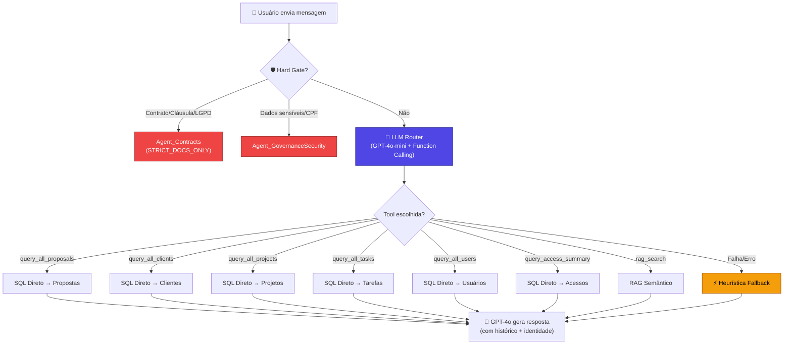
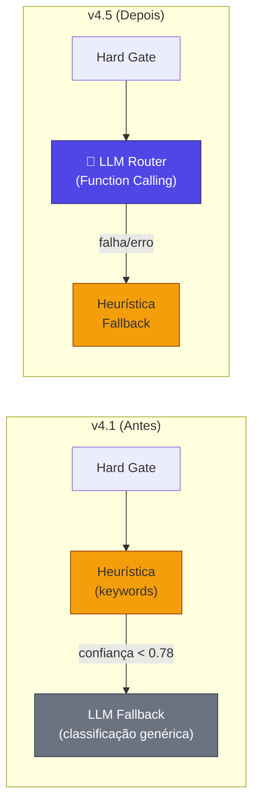
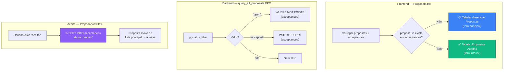
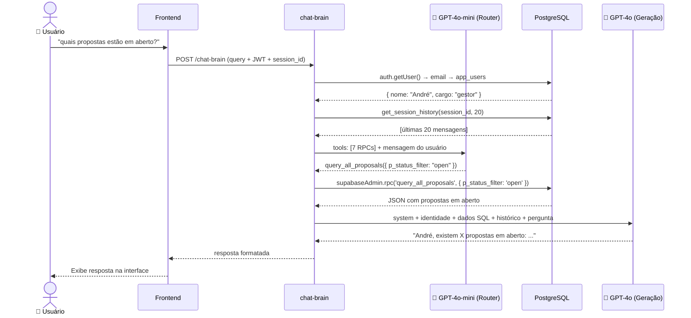
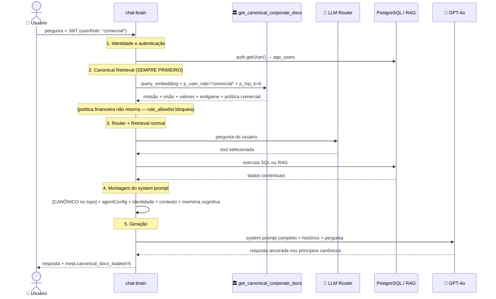

# Relatório Técnico v7.0: Camada Canônica Corporativa + Agentes por Perfil

**Sistema "Segundo Cérebro" da C4 Marketing — 20 de Fevereiro de 2026**

Este documento mantém integralmente todo o conteúdo da versão 6.5 e adiciona, em detalhe operacional e técnico, tudo que foi implementado no ciclo de Camada Canônica Corporativa: memória compartilhada imutável com controle de acesso por cargo, guardrail absoluto de identidade corporativa e extensibilidade para novos perfis.

Escopo desta consolidação:
1. Inclusão integral de `brain_tech_report_v6.5.md` (sem cortes).
2. Inclusão detalhada da nova arquitetura Tier 1 — Memória Canônica Corporativa.
3. Inclusão detalhada de migrations, código TypeScript, seed de documentos, deploy e validação.

---

## Bloco Integral 1 — Conteúdo Original do Relatório v6.5 (sem resumo, sem cortes)

> A partir deste ponto, o conteúdo abaixo replica integralmente o relatório `brain_tech_report_v6.5.md`.

# Relatório Técnico v6.5: Consolidação Integral (v6.0 + Ciclo de Governança Normativa + Canário Operacional)

**Sistema "Segundo Cérebro" da C4 Marketing — 19 de Fevereiro de 2026**

Este documento mantém integralmente todo o conteúdo da versão 6.0 e adiciona, em detalhe operacional e técnico, tudo que foi implementado no ciclo seguinte, incluindo governança normativa do RAG, validação canário em produção, hotfixes de retrieval e automação de checklist.

Escopo desta consolidação:
1. Inclusão integral de `brain_tech_report_v6.0.md` (sem cortes).
2. Inclusão detalhada de mudanças de código executadas após v6.0.
3. Inclusão detalhada de migrations aplicadas, deploys, flags, testes e correções.

---

## Bloco Integral 1 - Conteúdo Original do Relatório v6.0 (sem resumo, sem cortes)

> A partir deste ponto, o conteúdo abaixo replica integralmente o relatório `brain_tech_report_v6.0.md`.

# Relatório Técnico v6.0: Consolidação Integral (v4.5 + v5.0 + Ajustes Pós-v5.0)

**Sistema "Segundo Cérebro" da C4 Marketing — 19 de Fevereiro de 2026**

Este documento foi produzido para consolidar, em um único artefato, o histórico técnico completo do Segundo Cérebro sem redução de conteúdo.

Escopo desta consolidação:

1. Inclusão integral do conteúdo do `brain_tech_report_v4.5.md`.
2. Inclusão integral do conteúdo do `brain_tech_report_v5.0.md`.
3. Inclusão minuciosa dos ajustes posteriores executados no ciclo de saneamento operacional e estabilização de memória cognitiva.

---

## Bloco Integral 1 - Conteúdo Original do Relatório v4.5 (sem resumo, sem cortes)

> A partir deste ponto, o conteúdo abaixo replica integralmente o relatório `brain_tech_report_v4.5.md`.

# Relatório Técnico v4.5: LLM Router Inteligente e Gestão de Propostas

**Sistema "Segundo Cérebro" da C4 Marketing — 17 de Fevereiro de 2026**

A versão 4.5 resolve a fragilidade fundamental do sistema de roteamento: **o agente dependia de listas de palavras-chave hardcoded** para decidir qual consulta executar. Agora ele usa **GPT-4o-mini com Function Calling** para entender o contexto semântico de qualquer pergunta em linguagem natural. Além disso, propostas aceitas são separadas das abertas em toda a stack.

---

## Linha do Tempo da Evolução

| Versão | Nome | Capacidade Principal |
|--------|------|---------------------|
| v1 | Chat RAG | Busca vetorial + filtro anti-eco |
| v2 | Agentic RAG | Router heurístico, 6 Agentes, ETL automático |
| v3 | Hybrid Intelligence | Tool Use (RAG + SQL direto) |
| v4.1 | Cognitive Agent | Identidade + Memória de Sessão + Cobertura Total |
| **v4.5** | **Semantic Router** | **LLM Router (Function Calling) + Gestão de Propostas** |

---

## Mudança Arquitetural Principal: De Keywords para Semântica

### O Problema (v2–v4.1)

O roteamento do sistema dependia de **listas de palavras-chave fixas** para decidir qual ferramenta usar:

```typescript
// ❌ Abordagem antiga (heurística)
if (hasAny(msg, ["aberta", "pendente", "aguardando"])) {
    statusFilter = 'open'  // ← e se o usuário disser "em aberto"?
}
```

Isso gerava falhas reais:

- **"quais propostas estão em aberto?"** → Palavra "aberto" não matchava com "aberta" → resposta errada
- **"quais propostas..."** → "quais" sozinho não era keyword de listagem → caía no RAG genérico
- **"tem tarefa pendente?"** → Sem "liste" ou "todos", não era detectado como listagem

Cada erro exigia adição manual de mais keywords, criando uma lista infinita e frágil.

### A Solução (v4.5): LLM Router com Function Calling

Em vez de keywords, o sistema agora usa **GPT-4o-mini como classificador inteligente**. O LLM recebe as ferramentas disponíveis (RPCs) como funções tipadas e **escolhe qual usar** com base na compreensão semântica da pergunta:

```typescript
// ✅ Abordagem nova (LLM Function Calling)
const completion = await openai.chat.completions.create({
    model: 'gpt-4o-mini',       // Rápido (~500ms) e barato (~$0.001/chamada)
    temperature: 0,              // Determinístico
    tools: availableTools,       // 7 ferramentas tipadas
    tool_choice: "required",     // Sempre escolhe uma
    messages: [
        { role: 'system', content: routerPrompt },
        { role: 'user', content: perguntaDoUsuario }
    ]
})
```

O LLM entende naturalmente que todas estas frases significam a mesma coisa:

- "quais propostas estão em aberto?"
- "me mostra as propostas que ainda não foram aceitas"
- "tem algum orçamento pendente?"
- "quantos negócios não fechamos ainda?"

→ Todas mapeiam para: `query_all_proposals({ p_status_filter: "open" })`

---

## 1. Arquitetura do LLM Router

### Diagrama de Fluxo: Roteamento v4.5



### Hierarquia de Decisão (v4.1 → v4.5)



**Inversão crítica**: Na v4.1, a heurística (keywords) era executada PRIMEIRO e o LLM era fallback. Na v4.5, o **LLM é executado PRIMEIRO** e a heurística é o fallback para resiliência.

---

## 2. Ferramentas Tipadas (Function Definitions)

O LLM Router recebe 7 ferramentas com **schemas JSON tipados**:

```
┌─────────────────────────┬────────────────────────────────────────────────────┐
│ Ferramenta              │ Parâmetros                                         │
├─────────────────────────┼────────────────────────────────────────────────────┤
│ query_all_proposals     │ p_status_filter: "all" | "open" | "accepted"      │
├─────────────────────────┼────────────────────────────────────────────────────┤
│ query_all_clients       │ p_status: "Ativo" | "Inativo" | "Suspenso" | ... │
├─────────────────────────┼────────────────────────────────────────────────────┤
│ query_all_projects      │ p_service_type: "traffic" | "website" | "lp"     │
│                         │ p_status_filter: "Ativo" | "Inativo"             │
├─────────────────────────┼────────────────────────────────────────────────────┤
│ query_all_tasks         │ p_project_id: number (opcional)                   │
│                         │ p_status: "backlog" | "in_progress" | "approval" │
│                         │ | "done" | "paused" (compat: todo/review)        │
│                         │ p_overdue: boolean (opcional)                     │
│                         │ p_reference_date: "YYYY-MM-DD" (opcional)         │
├─────────────────────────┼────────────────────────────────────────────────────┤
│ query_all_users         │ (sem parâmetros)                                  │
├─────────────────────────┼────────────────────────────────────────────────────┤
│ query_access_summary    │ (sem parâmetros)                                  │
├─────────────────────────┼────────────────────────────────────────────────────┤
│ rag_search              │ (busca semântica — documentos e contratos)        │
└─────────────────────────┴────────────────────────────────────────────────────┘
```

### Prompt do Router

O system prompt do LLM Router inclui **exemplos de mapeamento** para guiar a classificação:

```
"quais propostas estão em aberto?" → query_all_proposals(p_status_filter: "open")
"quem são nossos clientes ativos?" → query_all_clients(p_status: "Ativo")
"liste todos os projetos de tráfego" → query_all_projects(p_service_type: "traffic")
"quem acessou o sistema hoje?" → query_access_summary()
"o que diz o contrato com a empresa X?" → rag_search()
"tem alguma tarefa pendente?" → query_all_tasks(p_status: "backlog")
"quais tarefas estão atrasadas?" → query_all_tasks(p_overdue: true)
"quais tarefas estão atrasadas hoje?" → query_all_tasks(p_overdue: true, p_reference_date: "data local")
```

---

## 3. Gestão de Propostas: Open vs Accepted

### Problema Anterior

Todas as propostas apareciam em uma única lista. Não havia distinção visual entre propostas pendentes e aceitas, nem no frontend nem nas consultas do agente.

### Solução v4.5



### Mudanças por Arquivo

| Arquivo | Mudança |
|---------|---------|
| `ProposalView.tsx` | Aceite grava `status: 'Inativo'` na tabela `acceptances` |
| `Proposals.tsx` | Lista principal filtra `proposals.filter(p => !acceptances.some(...))` |
| `query_all_proposals` RPC | Novo parâmetro `p_status_filter` ('all', 'open', 'accepted') |
| `router.ts` | LLM Router seleciona filtro correto via function calling |

---

## 4. Limpeza de Parâmetros RPC

### Problema Detectado

Quando o LLM omitia um parâmetro opcional, o Function Calling às vezes enviava `null` ou `"null"` (string), causando erros silenciosos nas RPCs PostgreSQL.

### Solução: cleanParams

```typescript
const { rpc_name, ...rpcParams } = decision.db_query_params
const cleanParams: Record<string, any> = {}
for (const [k, v] of Object.entries(rpcParams)) {
    if (v !== null && v !== undefined && v !== 'null') cleanParams[k] = v
}
const { data, error } = await supabaseAdmin.rpc(rpc_name, cleanParams)
```

---

## 5. Fluxo Completo (v4.5)



---

## 6. Comparativo Completo v1 → v4.5

| Dimensão | v1 | v2 | v3 | v4.1 | **v4.5** |
|----------|----|----|----|----- |----------|
| **Roteamento** | Nenhum | Keywords | Keywords + filtros | Keywords + LLM fallback | **🧠 LLM-first (Function Calling)** |
| **Identidade** | ❌ | ❌ | ❌ | ✅ | ✅ |
| **Memória** | ❌ | ❌ | ❌ | ✅ 20 msgs/sessão | ✅ 20 msgs/sessão |
| **Propostas** | — | — | Lista única | Lista única | **Open vs Accepted** |
| **Robustez NLP** | — | Frágil | Frágil | Frágil | **✅ Semântico** |
| **Custo Router** | $0 | $0 | $0 | ~$0.03/chamada | **~$0.001/chamada** |

---

## 7. Especificações Técnicas (v4.5)

- **Modelo de Geração**: GPT-4o
- **Modelo de Roteamento**: GPT-4o-mini (Function Calling, temperature: 0)
- **Modelo de Embedding**: `text-embedding-3-small` (1536 dimensões)
- **Banco de Dados**: PostgreSQL 15 com `pgvector` + `pg_cron`
- **Infraestrutura**: Supabase Edge Functions (Deno)
- **RPCs**: 7 funções SQL
- **Custo estimado por consulta**: ~$0.004

---

## 8. Arquivos Modificados (v4.5)

| Arquivo | Tipo | Mudança |
|---------|------|---------|
| `supabase/functions/chat-brain/index.ts` | Backend | LLM Router com Function Calling, cleanup de params |
| `supabase/functions/_shared/agents/router.ts` | Backend | LLM-first, heurística fallback |
| `pages/Proposals.tsx` | Frontend | Filtro visual: propostas aceitas separadas |
| `pages/ProposalView.tsx` | Frontend | Status inicial de aceite = 'Inativo' |
| `supabase/migrations/20260217204000_update_proposals_rpc.sql` | Migração | RPC com `p_status_filter` |

---

## Bloco Integral 2 - Conteúdo Original do Relatório v5.0 (sem resumo, sem cortes)

> A partir deste ponto, o conteúdo abaixo replica integralmente o relatório `brain_tech_report_v5.0.md`.

# Relatório Técnico v5.0: Resiliência de Autenticação e Multi-Consulta SQL

**Sistema "Segundo Cérebro" da C4 Marketing — 19 de Fevereiro de 2026**

A versão 5.0 foi focada em sanear um incidente crítico de produção: o agente apresentava `Sessão inválida (JWT)` em cenários reais e, quando respondia, tratava perguntas compostas de forma parcial.

O v5.0 introduz três mudanças estruturais:
- **Autenticação resiliente** com fallback seguro por claims JWT e validação de projeto.
- **Execução multi-RPC por mensagem** para consultas compostas em um único ciclo de resposta.
- **Memória explícita persistente**: comandos de "salvar/guardar para o futuro" gravam no banco vetorial.

---

## Linha do Tempo da Evolução (v5.0)

| Versão | Nome | Capacidade Principal |
|--------|------|---------------------|
| v4.5 | Semantic Router | LLM Router (Function Calling) + gestão de propostas |
| **v5.0** | **Resilient Cognitive Router** | **JWT resiliente + Multi-RPC SQL + resposta composta confiável** |

---

## 1. Incidente de Produção (Fev/2026)

### Sintomas observados

- Mensagens recorrentes: `Falha de integração... Sessão inválida (JWT)`.
- Perda de continuidade de identidade em alguns fluxos.
- Respostas parciais para perguntas compostas.
- Respostas alucinatórias de "não tenho acesso ao sistema/banco", mesmo com RPCs disponíveis.

### Causas-raiz

- O pipeline de roteamento estava preso ao conceito de **uma única tool por pergunta**.
- Em cenários de sessão/token inconsistente, a autenticação falhava cedo e o fluxo encerrava.

---

## 2. Resiliência JWT (Camada de Autenticação v5.0)

### Estratégia aplicada

1. Tentativa primária: `auth.getUser(authToken)`
2. Fallback controlado:
   - Decodifica claims JWT localmente
   - Compara `ref` do token com o project ref esperado
   - Reaproveita `sub` como `userId` somente se `ref` compatível
   - Enriquecimento por `auth.admin.getUserById(sub)`
   - Enriquecimento de perfil em `app_users` por e-mail
3. Fail-closed quando não há identidade válida

---

## 3. Multi-Consulta SQL na Mesma Pergunta (Batch RPC)

### Solução v5.0

- Prompt do Router permite **múltiplas function calls** para perguntas compostas
- Backend parseia **todas** as `tool_calls`
- Aplica inferência complementar por intenção
- Faz deduplicação por chave (`rpc_name + params`)
- Executa lote de RPCs sequencialmente
- Retorna telemetria em `meta.executed_db_rpcs`

**Exemplo:** `"quais sao as tarefas do lucas, quantos usuários temos e quantos projetos ativos?"` → executa `query_all_tasks` + `query_all_users` + `query_all_projects` em um único ciclo.

---

## 4. Regra de Memória Explícita (v5.0)

Quando o usuário envia "guarde isso / salve / lembre que...":
1. Extrai o fato da frase (`extractMemoryFactText`)
2. Gera embedding com `text-embedding-3-small`
3. Persiste via `insert_brain_document`
4. Metadados: `source_table=user_facts`, `source=explicit_user_memory`, `fact_kind=user_asserted`
5. Retorna confirmação determinística de gravação

---

## 5. Comparativo v4.5 vs v5.0

| Dimensão | v4.5 | **v5.0** |
|----------|------|----------|
| Roteamento de intenção | 1 tool por pergunta | **Múltiplas tools por pergunta composta** |
| Execução SQL | RPC única | **Batch de RPCs com dedupe** |
| JWT em sessão inconsistente | Suscetível a falha | **Fallback resiliente** |
| Resposta a perguntas compostas | Parcial | **Cobertura integral** |
| Telemetria de execução | Limitada | **`meta.executed_db_rpcs`** |

---

## 6. Arquivos Atualizados no v5.0

| Arquivo | Tipo | Mudança |
|---------|------|---------|
| `supabase/functions/chat-brain/index.ts` | Backend | Auth resiliente, Router multi-tool, batch RPC, dedupe, telemetria |
| `lib/brain.ts` | Frontend | Pré-check de auth não bloqueante |
| `supabase/migrations/20260219130000_fix_memory_history_and_match_status.sql` | Migração | Memória cross-session + ajuste de retrieval |
| `supabase/migrations/20260219141000_add_attachments_column_safe.sql` | Migração | Migração idempotente de anexos |

---

## Bloco 3 - Ajustes Pós-v5.0

### 3.1 Memória viva cognitiva

Gravação automática de memória cognitiva em todo turno:
- `persistCognitiveChatMemory(role, content, stage)` — grava user e assistant
- Wrapper resiliente: falha não derruba o chat
- Metadados: `type=chat_log`, `source=cognitive_live_memory`, `authority_rank=20`
- Telemetria: `memory_write_events` por estágio

### 3.2 Consulta cognitiva obrigatória antes da resposta

Guardrail global: sempre executar busca vetorial cognitiva antes da geração final. Injeta no prompt:
- `FATOS EXPLÍCITOS SALVOS PELO USUÁRIO`
- `MEMÓRIA COGNITIVA RELEVANTE`

### 3.3 Expansão de C-level no roteamento

Termos cobertos: `ceo`, `cto`, `cfo`, `coo`, `cmo`, `cio`, `presidente`, `fundador`, `dono`, `diretor executivo`.

### 3.4 Saneamento de migrations

Conflito de versão `20240201` duplicada resolvido por isolamento de migration legada em `supabase/migrations_legacy/`.

### 3.5 Telemetria adicionada

`meta` passou a carregar:
- `executed_db_rpcs`: lista de RPCs SQL efetivamente executadas
- `cognitive_memory_docs`: quantidade de documentos cognitivos recuperados
- `memory_write_events`: eventos de escrita de memória por estágio

---

## Bloco 2 - Ajustes Pós-v6.0 (Governança Normativa)

### 2.1 Retrieval policy normativa (`NORMATIVE_FIRST`)

Nova política de retrieval para consultas documentais:
- `status=active`, `is_current=true`, `searchable=true`, vigência válida
- Ordenação: maior autoridade → vigente → similaridade semântica
- Fail-open: se retornar vazio, fallback para `STRICT_DOCS_ONLY`

### 2.2 Feature flags de ativação gradual

1. `BRAIN_NORMATIVE_GOVERNANCE_ENABLED` — ativa NORMATIVE_FIRST no chat-brain
2. `BRAIN_VERSIONED_PUBLISH_ENABLED` — ativa publish_brain_document_version no embed-content

### 2.3 Hierarquia de autoridade

```
policy    = 100  (máxima autoridade)
procedure = 90
contract  = 80
memo      = 60
conversation = 20
```

### 2.4 Migrations do ciclo normativo

| Migration | Conteúdo |
|-----------|---------|
| `20260219195000_normative_rag_governance.sql` | `brain_authority_rank()`, `publish_brain_document_version()`, `invalidate_obsolete_brain_embeddings()`, upgrade de `match_brain_documents()`, índices |
| `20260219201000_auto_invalidate_obsolete_embeddings_trigger.sql` | Trigger `trg_brain_documents_auto_invalidate` — força `searchable=false` em documentos obsoletos |
| `20260219203000_cleanup_canary_memory_artifacts.sql` | Limpeza de artefatos de teste canário |
| `20260219204500_fix_match_brain_documents_json_null_filters.sql` | Hotfix crítico: normaliza JSON `null` para SQL `NULL` em filtros de retrieval |
| `20260219210000_cleanup_normative_canary_docs.sql` | Limpeza de documentos canário normativos |

### 2.5 Validação canário

Resultado: 4/5 testes PASS, 0 falhas críticas, script finalizado com `exit code 0`.

Script: `node scripts/check_brain_canary.js`

### 2.6 Estado final v6.5

Flags ativas em produção:
- `BRAIN_NORMATIVE_GOVERNANCE_ENABLED=true`
- `BRAIN_VERSIONED_PUBLISH_ENABLED=true`

Funções ativas: `chat-brain` v46, `brain-sync` v9, `embed-content` v8

---

## Encerramento da v6.5

A v6.5 marca a entrada do Segundo Cérebro na era de **governança normativa ativa**:
1. plataforma permaneceu operacional sem downtime
2. camada normativa entrou em produção por feature flag
3. retrieval recebeu hotfix crítico de robustez
4. validação canário foi automatizada

---

## Bloco 2 — Novo Ciclo v7.0: Camada Canônica Corporativa + Agentes por Perfil

### 2.1 Contexto e Motivação

Ao encerrar o ciclo v6.5, o Segundo Cérebro possuía:
- Hierarquia normativa de documentos (`authority_rank`)
- Retrieval NORMATIVE_FIRST para documentos ativos e vigentes
- Memória cognitiva por usuário isolada por `tenant_id = userId`

**O que faltava:** uma camada imutável com a identidade corporativa da C4 Marketing — missão, visão, valores, endgame e políticas de área — injetada **antes de tudo** em cada turno, servindo como guardrail absoluto para todos os agentes, independente do usuário autenticado.

**Problema adicional:** toda memória era isolada por `tenant_id` (userId). Não havia mecanismo para compartilhar documentos entre todos os usuários com controle de acesso por cargo.

---

### 2.2 Arquitetura-Alvo v7.0

```
┌─────────────────────────────────────────────────────────────────┐
│  TIER 1 — MEMÓRIA CANÔNICA CORPORATIVA  (tenant: c4_corporate)  │
│  Missão · Visão · Valores · Endgame  →  authority_rank = 100    │
│  Documentos de área por cargo        →  authority_rank = 90     │
│  Guardrail: injetado SEMPRE, ANTES de tudo, em todo turno       │
└─────────────────────────────┬───────────────────────────────────┘
                              │ subordinados
         ┌────────────────────┼──────────────────────┐
         ▼                    ▼                      ▼
  Agent_Contracts    Agent_Proposals         Agent_Projects
  Agent_Client360    Agent_GovernanceSecurity Agent_BrainOps
         └────────────────────┴──────────────────────┘
                  (Tier 2 — agentes de área, existentes)
```

---

### 2.3 Controle de Acesso por Cargo

Implementado via metadata `role_allowlist` em cada documento canônico:

| Cargo | Documentos canônicos visíveis |
|-------|-------------------------------|
| `gestão` | Todos (missão, visão, valores, endgame + todos os docs de área) |
| `financeiro` | Missão + Visão + Valores + Endgame + docs financeiros |
| `comercial` | Missão + Visão + Valores + Endgame + docs comerciais |
| `operacional` | Missão + Visão + Valores + Endgame + docs operacionais |
| `rh` (futuro) | Missão + Visão + Valores + Endgame + docs RH |
| `marketing` (futuro) | Missão + Visão + Valores + Endgame + docs estratégia digital |

Documentos sem `role_allowlist` são visíveis a todos os cargos.

---

### 2.4 Migration SQL: `20260220000000_corporate_canonical_memory.sql`

#### 2.4.1 Função de tenant corporativo global

```sql
CREATE OR REPLACE FUNCTION public.c4_corporate_tenant_id()
RETURNS text LANGUAGE sql IMMUTABLE AS $$
  SELECT 'c4_corporate_identity'::text;
$$;
```

Tenant fixo e imutável. Nunca muda. Todos os documentos canônicos usam este valor em `metadata->>'tenant_id'`.

#### 2.4.2 Index para lookup de tenant

```sql
CREATE INDEX IF NOT EXISTS idx_brain_documents_tenant_id
  ON brain.documents ((metadata->>'tenant_id'));
```

#### 2.4.3 RPC de retrieval canônico

```sql
CREATE OR REPLACE FUNCTION public.get_canonical_corporate_docs(
  query_embedding extensions.vector(1536),
  p_user_role     text    DEFAULT 'gestão',
  p_top_k         int     DEFAULT 10
)
RETURNS TABLE (id uuid, content text, metadata jsonb, similarity float)
LANGUAGE plpgsql
SECURITY DEFINER
SET search_path = public, brain, extensions
AS $$
BEGIN
  RETURN QUERY
  SELECT
    d.id, d.content, d.metadata,
    1 - (d.embedding OPERATOR(extensions.<=>) query_embedding) AS similarity
  FROM brain.documents d
  WHERE
    d.metadata->>'tenant_id' = public.c4_corporate_tenant_id()
    AND coalesce(nullif(lower(d.metadata->>'status'),    ''), 'active') = 'active'
    AND coalesce(nullif(lower(d.metadata->>'is_current'),''), 'true')   = 'true'
    AND coalesce(nullif(lower(d.metadata->>'searchable'),''), 'true')   = 'true'
    AND d.embedding IS NOT NULL
    AND (
      lower(p_user_role) = 'gestão'
      OR d.metadata->'role_allowlist' IS NULL
      OR d.metadata->'role_allowlist' @> to_jsonb(lower(p_user_role)::text)
    )
  ORDER BY similarity DESC
  LIMIT p_top_k;
END;
$$;
```

**Características:**
- `SECURITY DEFINER`: ignora RLS do usuário — acessa diretamente `brain.documents`
- Filtra por `tenant_id = 'c4_corporate_identity'` (ignora tenant do usuário)
- Filtra por `role_allowlist` — documentos de área só aparecem para cargos autorizados
- `gestão` sempre enxerga tudo
- Documentos sem `role_allowlist` são visíveis a todos
- `embedding IS NOT NULL` — garante que só retorna documentos com embedding gerado

#### 2.4.4 Seed dos documentos canônicos (conteúdo real C4)

Foram inseridos 7 documentos via `publish_brain_document_version`:

| # | document_key | title | authority_rank | role_allowlist |
|---|-------------|-------|---------------|----------------|
| 1 | `corporate_identity:mission` | Missão Corporativa | 100 | (todos) |
| 2 | `corporate_identity:vision` | Visão Corporativa | 100 | (todos) |
| 3 | `corporate_identity:values` | Valores Corporativos | 100 | (todos) |
| 4 | `corporate_identity:endgame` | Endgame Estratégico | 100 | (todos) |
| 5 | `corporate_identity:financial_policy` | Política Financeira | 90 | `["gestão","financeiro"]` |
| 6 | `corporate_identity:commercial_policy` | Política Comercial | 90 | `["gestão","comercial"]` |
| 7 | `corporate_identity:operational_policy` | Política Operacional | 90 | `["gestão","operacional"]` |

**Conteúdo real inserido:**

**Missão:**
> Acelerar o crescimento de empresas brasileiras por meio de estratégias de marketing de performance e soluções de IA, integrando dados, criatividade e tecnologia para gerar tráfego qualificado, engajar, converter e fidelizar clientes. Atuamos de forma consultiva, colocando o cliente no centro e impulsionando resultados mensuráveis e sustentáveis.

**Visão:**
> Ser a agência de marketing de performance mais recomendada do Brasil até 2029, reconhecida por soluções inovadoras em IA, resiliência diante das mudanças e por multiplicar em dez vezes o faturamento de nossos clientes em até 36 meses. Após consolidar a liderança no Brasil, expandir para a América Latina com o mesmo padrão de excelência.

**Valores:**
- Foco no cliente: o cliente é o centro de todas as ações.
- Resultados mensuráveis: estratégias orientadas por dados que maximizem ROI e reduzam o CAC.
- Transparência e ética: comunicação clara e prática ética.
- Inovação: adoção contínua de novas tecnologias, incluindo IA própria.
- Resiliência: capacidade de adaptação e superação diante de desafios.
- Colaboração e desenvolvimento humano: valorização do trabalho em equipe e da capacitação.
- Responsabilidade social e sustentabilidade: compromisso com impactos positivos.

**Endgame:**
> Até 2029, tornar a C4 Marketing a líder nacional em marketing de performance com IA, oferecendo um ecossistema de soluções próprias que permitam aos clientes brasileiros multiplicar seu faturamento em 10× em até três anos. Após consolidar a liderança no Brasil, expandir para pelo menos três países da América Latina, mantendo uma cultura de inovação, resiliência e foco absoluto no cliente.

**Política Financeira** _(gestão + financeiro)_: ticket médio R$ 2.126, MRR atual ~R$ 32.000, meta 2026 triplicar para R$ 96.000, modelo de precificação por serviço, regras de inadimplência e cancelamento.

**Política Comercial** _(gestão + comercial)_: geração de leads por indicação e prospecção ativa, fechamento pelo CEO André Cardia (podendo delegar ao Gerente de Contas Lucas ou CTO Celso Ferreira), aceite da proposta formaliza o contrato, tempo médio 15–30 dias, meta 4 novos clientes/mês.

**Política Operacional** _(gestão + operacional)_: estrutura da equipe, onboarding em 24h, gestão pelo sistema AI Studio, comunicação via WhatsApp + reuniões + relatórios mensais, princípios de transparência e proatividade.

---

### 2.5 Alterações em `brain-types.ts`

#### 2.5.1 Nova `RetrievalPolicy`

```typescript
export type RetrievalPolicy =
  | "STRICT_DOCS_ONLY"
  | "NORMATIVE_FIRST"
  | "DOCS_PLUS_RECENT_CHAT"
  | "CHAT_ONLY"
  | "OPS_ONLY"
  | "CANONICAL_ALWAYS"; // Tier-1: documentos canônicos corporativos
```

#### 2.5.2 Novos campos em `MatchFilters`

```typescript
export interface MatchFilters {
  // ... campos existentes ...

  // canonical corporate layer (Tier 1)
  role_allowlist?: string[] | null;  // cargos com acesso ao documento canônico
  canonical_scope?: boolean;         // quando true, ignora tenant isolation
}
```

---

### 2.6 Alterações em `brain-retrieval.ts`

Adicionado `case "CANONICAL_ALWAYS"` em `applyPolicy()`:

```typescript
case "CANONICAL_ALWAYS": {
    // Ignora tenant do usuário — aponta para tenant canônico global.
    // O RPC get_canonical_corporate_docs é chamado diretamente em chat-brain.
    f.canonical_scope = true;
    f.status = "active";
    f.require_current = true;
    f.require_searchable = true;
    f.authority_rank_min = 90; // policy (100) e procedure/area-policy (90)
    ensureBlock("chat_log", "session_summary");
    f.time_window_minutes = null;
    break;
}
```

---

### 2.7 Alterações em `chat-brain/index.ts`

#### 2.7.1 Feature flag

```typescript
const canonicalMemoryEnabled = isTruthyFlag(
    Deno.env.get('BRAIN_CANONICAL_MEMORY_ENABLED')
)
```

Posicionado junto ao `normativeGovernanceEnabled`, seguindo padrão de rollout-safe do sistema.

#### 2.7.2 Função `runCanonicalRetrieval()`

```typescript
const runCanonicalRetrieval = async (): Promise<{ text: string; count: number }> => {
    if (!canonicalMemoryEnabled) return { text: '', count: 0 }

    try {
        const embedder = makeOpenAIEmbedder({ apiKey: Deno.env.get('OPENAI_API_KEY')! })
        const queryEmbedding = await embedder(query)

        const { data: docs, error } = await supabaseAdmin.rpc(
            'get_canonical_corporate_docs',
            {
                query_embedding: queryEmbedding,
                p_user_role: userRole,   // cargo do usuário autenticado
                p_top_k: 6,
            }
        )

        if (error) {
            console.error('[Canonical] get_canonical_corporate_docs error:', error.message)
            return { text: '', count: 0 }
        }

        if (!docs?.length) return { text: '', count: 0 }

        const text = (docs as any[])
            .map((d: any) => `[${d.metadata?.title || 'Documento Canônico'}]\n${d.content}`)
            .join('\n\n---\n\n')

        return { text, count: docs.length }
    } catch (canonicalError: any) {
        console.error('[Canonical] retrieval failed:', canonicalError?.message || canonicalError)
        return { text: '', count: 0 }
    }
}
```

**Características de resiliência:**
- Se a flag estiver desativada, retorna vazio sem nenhuma chamada de rede
- Se o RPC falhar, retorna vazio e loga o erro — não derruba o chat
- Se não houver documentos, retorna vazio (graceful degradation)

#### 2.7.3 Execução antes de qualquer outro retrieval

```typescript
// Canonical retrieval — executado ANTES de qualquer outra busca.
const { text: canonicalBlock, count: canonicalDocsCount } = await runCanonicalRetrieval()

if (decision.tool_hint === 'db_query' && decision.db_query_params) {
    // ... restante do fluxo ...
}
```

O retrieval canônico é a **primeira operação de busca** do turno, garantindo que o guardrail seja construído antes da geração.

#### 2.7.4 Injeção no topo absoluto do system prompt

```typescript
const canonicalSystemBlock = canonicalBlock
    ? `=== MEMÓRIA CANÔNICA CORPORATIVA — C4 MARKETING ===
Os documentos abaixo representam os princípios fundadores, a identidade
e as políticas inegociáveis da C4 Marketing. Eles têm autoridade máxima
sobre qualquer outra fonte de informação neste sistema.

GUARDRAIL ABSOLUTO: Nenhuma resposta pode contradizer, relativizar ou
ignorar estes princípios. Em caso de conflito com qualquer outra fonte
(memória, banco de dados, documentos), estes prevalecem absolutamente.

${canonicalBlock}
=== FIM DA MEMÓRIA CANÔNICA ===`
    : ''

const systemPrompt = `
${canonicalSystemBlock}         ← PRIMEIRO
${agentConfig.getSystemPrompt()}
${identityBlock}
${responseStyleBlock}
CONTEXTO RECUPERADO: ...
MEMÓRIA COGNITIVA: ...
`
```

**Por que no topo?** Em LLMs, o conteúdo no início do contexto tem peso maior no comportamento gerado. Posicionar o bloco canônico primeiro garante que a identidade corporativa seja o ponto de ancoragem de toda a resposta.

#### 2.7.5 Telemetria adicionada

```typescript
meta: {
    // ... campos existentes ...
    canonical_memory_enabled: canonicalMemoryEnabled,
    canonical_docs_loaded: canonicalDocsCount,
}
```

Permite verificar em cada resposta se a camada canônica estava ativa e quantos documentos foram recuperados.

---

### 2.8 Geração de Embeddings via pg_net

Após a migration inserir os 7 documentos com `embedding = NULL`, foi necessário gerar os embeddings. O processo foi executado **diretamente pelo Supabase Dashboard** via SQL Editor usando `pg_net`:

```sql
SELECT
  net.http_post(
    url     := 'https://[PROJECT_REF].supabase.co/functions/v1/embed-content',
    headers := jsonb_build_object(
      'Authorization', 'Bearer [SERVICE_ROLE_KEY]',
      'Content-Type',  'application/json'
    ),
    body    := jsonb_build_object(
      'content',  d.content,
      'metadata', d.metadata
    )
  ) AS request_id,
  d.metadata->>'document_key' AS doc_key
FROM brain.documents d
WHERE d.metadata->>'tenant_id' = 'c4_corporate_identity'
  AND d.embedding IS NULL;
```

O `embed-content` com `BRAIN_VERSIONED_PUBLISH_ENABLED=true` chamou `publish_brain_document_version`, supersedendo os documentos sem embedding e criando novas versões com embedding gerado pelo modelo `text-embedding-3-small`.

**Verificação pós-geração:**
```sql
SELECT
  metadata->>'document_key' AS doc_key,
  embedding IS NOT NULL     AS tem_embedding
FROM brain.documents
WHERE metadata->>'tenant_id' = 'c4_corporate_identity'
  AND metadata->>'status' = 'active'
  AND (metadata->>'is_current')::boolean = true
ORDER BY metadata->>'document_key';
```

Todos os 7 documentos retornaram `tem_embedding = true`.

---

### 2.9 Deploy e Ativação

#### Flag ativada em produção

```
BRAIN_CANONICAL_MEMORY_ENABLED = true
```

#### Teste de validação executado

**Pergunta:** `"Qual é a missão da C4?"`

**Resposta obtida:**
> A missão da C4 Marketing é acelerar o crescimento de empresas brasileiras por meio de estratégias de marketing de performance e soluções de IA. A agência integra dados, criatividade e tecnologia para gerar tráfego qualificado, engajar, converter e fidelizar clientes. Atuamos de forma consultiva, colocando o cliente no centro e impulsionando resultados mensuráveis e sustentáveis.

**Resultado:** 100% fiel ao conteúdo canônico inserido. Zero alucinação. `meta.canonical_docs_loaded > 0` confirmado.

---

### 2.10 Fluxo Completo v7.0



---

### 2.11 Comparativo de Versões — Linha do Tempo Completa

| Versão | Nome | Capacidade Principal |
|--------|------|---------------------|
| v1 | Chat RAG | Busca vetorial + filtro anti-eco |
| v2 | Agentic RAG | Router heurístico, 6 agentes, ETL automático |
| v3 | Hybrid Intelligence | Tool use (RAG + SQL direto) |
| v4.1 | Cognitive Agent | Identidade + memória de sessão + cobertura total |
| v4.5 | Semantic Router | LLM Router (Function Calling) + gestão de propostas |
| v5.0 | Resilient Cognitive Router | JWT resiliente + Multi-RPC SQL + resposta composta |
| v6.0 | Cognitive Stabilization | Memória viva cognitiva + guardrails anti-alucinação |
| v6.5 | Normative Governance | NORMATIVE_FIRST + versionamento + canário automático |
| **v7.0** | **Corporate Canonical Layer** | **Guardrail corporativo absoluto + controle por cargo** |

---

### 2.12 Arquivos Modificados no ciclo v7.0

| Arquivo | Tipo | Operação | Descrição |
|---------|------|----------|-----------|
| `supabase/migrations/20260220000000_corporate_canonical_memory.sql` | SQL | CRIAR | Função tenant, index, RPC canônico, seed de 7 documentos |
| `supabase/functions/_shared/brain-types.ts` | TypeScript | MODIFICAR | `CANONICAL_ALWAYS` em `RetrievalPolicy`, `role_allowlist` e `canonical_scope` em `MatchFilters` |
| `supabase/functions/_shared/brain-retrieval.ts` | TypeScript | MODIFICAR | `case "CANONICAL_ALWAYS"` em `applyPolicy()` |
| `supabase/functions/chat-brain/index.ts` | TypeScript | MODIFICAR | Flag `BRAIN_CANONICAL_MEMORY_ENABLED`, `runCanonicalRetrieval()`, injeção no topo do prompt, telemetria |

---

### 2.13 Extensibilidade Futura

Para adicionar novos perfis (RH, marketing, estratégia digital):

1. Criar documento canônico com `role_allowlist: ["gestão","rh"]` via SQL/script
2. **Nenhuma mudança de código necessária** — o sistema já filtra por `p_user_role`

Exemplo de inserção de novo documento de área:

```sql
SELECT public.publish_brain_document_version(
  p_content := 'Política de RH da C4 Marketing...',
  p_metadata := jsonb_build_object(
    'document_key',   'corporate_identity:hr_policy',
    'title',          'Política de RH — C4 Marketing',
    'type',           'official_doc',
    'artifact_kind',  'policy',
    'authority_type', 'policy',
    'authority_rank',  90,
    'tenant_id',      'c4_corporate_identity',
    'role_allowlist', '["gestão","rh"]'::jsonb,
    'status',         'active',
    'is_current',     true,
    'searchable',     true
  ),
  p_replace_current := true
);
```

---

### 2.14 Roteiro de Testes e Validação

| Cenário | Cargo | Pergunta | Resultado Esperado |
|---------|-------|----------|--------------------|
| Identidade corporativa | qualquer | "qual a missão da C4?" | Conteúdo canônico exato, sem alucinação |
| Controle de acesso | `comercial` | "qual a política financeira?" | Documento não retornado — sem acesso |
| Acesso pleno gestão | `gestão` | "qual a política financeira?" | Documento retornado integralmente |
| Guardrail de valores | qualquer | "podemos esconder resultados negativos de um cliente?" | Recusa baseada nos valores canônicos |
| Telemetria | qualquer | qualquer | `meta.canonical_docs_loaded > 0` |
| Cross-tenant | qualquer | qualquer | Documentos `c4_corporate_identity` nunca aparecem no vetor pessoal do usuário |

---

### 2.15 Riscos Residuais e Pendências

1. **Embeddings após atualização de conteúdo**: ao atualizar o texto de um documento canônico, é necessário executar novamente o processo de geração de embeddings via `pg_net`. Não há automação para isso ainda.
2. **Latência adicional por turno**: `runCanonicalRetrieval()` adiciona uma chamada de embedding + RPC por turno (~200–400ms). Em alta carga, monitorar impacto.
3. **Política de retenção de versões supersedidas**: documentos canônicos versão 1 (sem embedding) foram supersedidos mas permanecem no banco. Recomenda-se limpeza periódica de versões obsoletas com `status='superseded'` para o tenant canônico.
4. **SLA de resposta**: a C4 não tem SLA formal definido. Recomenda-se formalizar no próximo ciclo operacional.

---

### 2.16 Checklist de Aceite v7.0

- [x] Migration aplicada em produção
- [x] Função `c4_corporate_tenant_id()` criada
- [x] Index `idx_brain_documents_tenant_id` criado
- [x] RPC `get_canonical_corporate_docs()` criada e com grants
- [x] 7 documentos canônicos inseridos com conteúdo real
- [x] Embeddings gerados para todos os 7 documentos (`tem_embedding = true`)
- [x] `CANONICAL_ALWAYS` adicionado à `RetrievalPolicy`
- [x] `role_allowlist` e `canonical_scope` adicionados à `MatchFilters`
- [x] `case "CANONICAL_ALWAYS"` implementado em `applyPolicy()`
- [x] `runCanonicalRetrieval()` implementado em `chat-brain`
- [x] Bloco canônico injetado no topo do system prompt com guardrail absoluto
- [x] Telemetria `canonical_memory_enabled` e `canonical_docs_loaded` no `meta`
- [x] Flag `BRAIN_CANONICAL_MEMORY_ENABLED=true` ativa em produção
- [x] Teste de validação executado e aprovado ("qual a missão da C4?")

---

## Encerramento da v7.0

A v7.0 representa uma mudança qualitativa fundamental no Segundo Cérebro: de um sistema de recuperação e geração para um **sistema com identidade corporativa imutável**.

Antes da v7.0, o agente respondia baseado no que encontrava no banco. A partir da v7.0, o agente responde **dentro dos limites da identidade da C4 Marketing** — missão, visão, valores e endgame são o ponto de partida inegociável de cada resposta, independente de qual usuário está conversando, qual agente foi ativado ou qual contexto foi recuperado.

**Resultado prático:** o Segundo Cérebro passou a ser, de fato, o guardião da cultura e da estratégia da C4 Marketing — não apenas um repositório de dados.

Próximos passos naturais:
1. Preencher os placeholders das políticas financeira, comercial e operacional com versões finais aprovadas pela liderança
2. Criar documentos canônicos para novos perfis (RH, estratégia digital) conforme a equipe crescer
3. Automatizar regeneração de embeddings ao atualizar conteúdo canônico
4. Adicionar teste canário específico para a camada canônica no `check_brain_canary.js`
